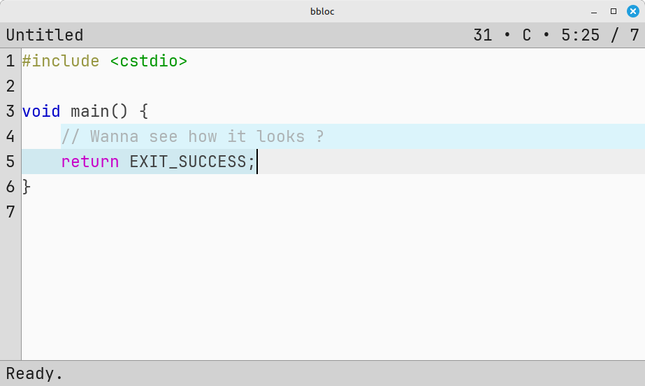

# bbloc

bbloc is a minimalist toy text editor developed in C++ using SDL2, OpenGL, glad, Freetype, utfcpp, and tree-sitter.

There are missing key features but most importantly:

- Undo/Redo
- Search/Replace
- "\t" does not align on columns (does not align well when mixing with spaces).
- More and better syntax highlight.
- Better error handling.
- Better inline documentation.

### Concept
The application window is divided into three parts:  

- The information top bar.  
  Displays information about the current text buffer, like its position, current highlight mode, font size, ect.

- The text area.  
  That is the area that display the content of the text buffer.

- The prompt bottom bar.  
  That is the area where users can type command to run specific actions.

Every action but text typing is implemented into a command. To enter a command, the prompt must be opened. **With the default configuration, the key combination to open the prompt is _"Ctrl+Shift+space"_.**

Action can be tied to keystrokes. For this, the "bind" command allows customizing how the editor reacts to keystrokes.  
Here is a list of the default key binding (see below for command description):

| Keys                 | Command                | Description                                                                                     |
|----------------------|------------------------|-------------------------------------------------------------------------------------------------|
| escape               | cancel                 | Cancel the current action (e.g. Prompt opened).                                                 |
| return               | validate               | Validate the current prompt string and try to run the command.                                  |
| Down                 | move down              | Try to move the cursor one line below.                                                          |
| Shift + Down         | move down true         | Try to move the cursor one line below, selecting all text in the process.                       |
| Left                 | move left              | Try to move the cursor one character left.                                                      |
| Shift + Left         | move left true         | Try to move the cursor one character left. Selecting the character in the process.              |
| Right                | move right             | Try to move the cursor one character right.                                                     |
| Shift + Right        | move right true        | Try to move the cursor one character right. Selecting the character in the process.             |
| Home                 | move bol               | Move the Cursor to the beginning of the current line.                                           |
| Shift + Home         | move bol true          | Move the Cursor to the beginning of the current line, selecting all text in the process.        |
| End                  | move eol               | Move the Cursor to the end of the current line.                                                 |
| Shift + End          | move eol true          | Move the Cursor to the end of the current line, selecting all text in the process.              |
| PageUp               | move page_up           | Move the cursor one page up. Amount of line is configurable via Cvar.                           |
| Shift + PageUp       | move page_up true      | Move the cursor one page up, selecting all text in the process.                                 |
| PageDown             | move page_down         | Move the cursor one page down. Amount of line is configurable via Cvar.                         |
| Shift + PageDown     | move page_down true    | Move the cursor one page down, selecting all text in the process.                               |
| Ctrl + c             | copy                   | Copy the current selected text into the systrem clipboard.                                      |
| Ctrl + x             | cut                    | Cut the current selected text from the buffer and copy it into thesystem clipboard.             |
| Ctrl + v             | paste                  | Paste the current text living in the system clipboard into the text buffer.                     |
| Ctrl + t             | cvar inf_draw_time     | Display the highest render time since reset.                                                    |
| Ctrl + Shift + t     | reset_draw_time        | Reset the highest render time to 0.0.                                                           |
| Ctrl + y             | cvar inf_command_time  | Display the highest command processing time.                                                    |
| Ctrl + Shift + y     | reset_command_time     | Reset the highest command processing time to 0.0.                                               |
| Ctrl + "Keypad +"    | set_font_size +        | Increase the font size by 1 unit.                                                               |
| Ctrl + "Keypad -"    | set_font_size -        | Decrease the font size by 1 unit.                                                               |
| Ctrl + Shift + s     | save                   | Save the current text buffer into a file. Will ask the user before overwrite any existing file. |
| Ctrl + Shift + space | activate_prompt        | Activate the prompt.                                                                            |
| Ctrl + Shift + q     | quit                   | Quit the application. Without saving.                                                           |
| tab                  | auto_complete forward  | Auto-complete the current prompt (if possible) in the forward direction.                        |
| Shift + tab          | auto_complete backward | Auto-complete the current prompt (if possible) in the backward direction.                       |

### Main components:

- **CommandManager**  
Commands can be registered to become available in the prompt. There is also a CVar system inspired from game engines. They are shared pointers living in random parts of the code and accessible from the CommandManager. Some variables and theme attributes can be changed at runtime using this system. The command prompt also supports a simple feedback from the user (depth: 1), and eventually displays one message after command execution. It also features auto-completion for commands and arguments and also provides some utilities like strings tokenization.

Current commands implemented are:

  | Command                                     | Description                                                                                                                                                                                                                                                                       |
  |---------------------------------------------|-----------------------------------------------------------------------------------------------------------------------------------------------------------------------------------------------------------------------------------------------------------------------------------|
  | **open \<filename\>**                       | Open the said file in the editor. This will try to set the highlight mode the corresponding language (via file extension).                                                                                                                                                        |
  | **save \<filename\> -f**                    | Save the current editor to disk with the said filename. Will ask for feedback if the file exists.<br/>If "**-f**" is used, will not ask for feedback and save directly (overwrite the existing file).                                                                             |
  | **quit**                                    | No arguments, exit the program without saving.                                                                                                                                                                                                                                    |
  | **cvar \<name\> [value1] [value2] ...**     | If only the cvar name is provided, prints its value in the prompt. Otherwise, will try to set the new value on the CVar.                                                                                                                                                          |
  | **reset_render_time**                       | No arguments. The CVar **inf_render_time** is read-only, and this command set its value back to 0. You can later check the value to see how much time was spent for rendering the window.                                                                                         |
  | **reset_command_time**                      | No arguments. The CVar **inf_command_time** is read-only, and this command set its value back to 0. You can later check the value to see how much time was spent for processing a command.                                                                                        |
  | **exec \<filename\>**                       | This will read the said file line by line and execute each command in it.<br/>There is some limitation: the exec will stop if feedback is needed, or if a message is returned from one the command in the list. (this is not well tested).                                        |
  | **set_hl_mode \<mode\>**                    | Change highlight mode in the editor.                                                                                                                                                                                                                                              |
  | **bind \<modifier\> \<key\> \<command\>**   | Bind key press to a command.<br/>Modifiers are "+" separated (e.g: Ctrl+Shift).<br/>If the command take some arguments, quote it.                                                                                                                                                 |
  | **set_font_size \<size\>**                  | Set the font size. Take "**-**", "**+**", or a size (e.g. 27) as argument.                                                                                                                                                                                                        |
  | **activate_prompt**                         | Activate the prompt.                                                                                                                                                                                                                                                              |
  | **copy**                                    | Copy the current selected text by the cursor to the clipboard.                                                                                                                                                                                                                    |
  | **paste**                                   | Paste the current text in the clipboard into the buffer.                                                                                                                                                                                                                          |
  | **cut**                                     | Cut the current selected text by the cursor, and put it in the clipboard.                                                                                                                                                                                                         |
  | **move \<direction\> \<expand_selection\>** | Move the cursor by some units. Direction is one of "**up**", "**down**", "**left**", "**righ**", "**bol**", "**eol**", "**bof**", "**eof**", "**page_up**", "**page_down**".<br/>If **expand_selection** is true, then the current move activate and or expand the selected text. |
  | **cancel**                                  | Cancel the current action (e.g. Will close the prompt if opened).                                                                                                                                                                                                                 |
  | **validate**                                | Validate the current action (e.g. Will validate the prompt and tries to run the input as a command).                                                                                                                                                                              |
  | **auto_complete \<direction\>**             | Provide auto-completion of the input string in the prompt, if possible. Direction can be "**forward**", "**backward**".                                                                                                                                                           |

  Current available CVar are:

  | Variable             | Type      | Description                                                                    |
  |----------------------|-----------|--------------------------------------------------------------------------------|
  | **inf_render_time**  | 1 float   | **Read-only.** Holds the maximum render time in seconds since last reset.      |
  | **inf_command_time** | 1 float   | **Read-only.** Holds the maximum command time in seconds since last reset.     |
  | **tab_to_space**     | 1 boolean | If true "\t" character is replaced by **dim_tab_to_space** space character(s). |
  | **col_\***           | 4 bytes   | Holds a theme color attribute. Each component (R, G, B, A) is **uint8_t**.     |
  | **dim_\***           | 1 int     | Holds a theme dimension attribute.                                             |

- **Cursor**  
The cursor holds a unique pointer to a TextBuffer implementation, which is responsible for storing the text data, insert and delete operation on it. In addition, the Cursor provides the caret location, and move functions, insert and delete functions (which use the TextBuffer implementation), and some utilities. After each operation on the Cursor that changes the underlying text, a BufferEdit struct is returned (backed by TextBuffer) so it can be passed to the highlighter to update its internal parse tree.

- **HighLighter**  
This uses tree-sitter for the text highlight feature. Nothing fancy, the most simplistic approach is used: tint character by their symbol representation. This is not ideal (like JSON showing same color for key:value, with strings) but seems to be working for now. The HighLighter is bound to a Cursor so it can read text from it. If the Cursor's text is edited, pass the BufferEdit object to the HighLighter so it can re-read the changed part and update the syntax color.

- **Renderer**  
The renderer use OpenGL and instantiated rendering. The glyph atlas is generated on the fly using the freetype library and populate a texture array used by the OpenGL renderer. One generated vertex in the application results in a textured and tinted quad on screen.

- **Theme**  
This holds convenient functions to access theme attributes like background or highlight colors and dimensions. It allows changing the font size, measure text width in pixels, and provide characters information (texture coordinates, size, ect).

- **Views**  
There is no real view system, but a base class that holds common data for the rendering parts of the application (info bar, editor, and prompt). They are tied to a ViewState which holds the data that the View needs for its purpose. SDL input events are passed to Views to they can manage user inputs.

- **ApplicationWindow**  
Manages the application resources, SDL main loop, and pump events to update the views accordingly.

### Dependencies

This use some external libray:

- [**SDL2**](https://github.com/libsdl-org/SDL) is used for the input and windowing system.
- [**Glad**](https://glad.dav1d.de/) is used as dynamic function loader for OpenGL.
- [**Freetype**](https://github.com/freetype) is used to generate font glyphs.
- [**utfcpp**](https://github.com/nemtrif/utfcpp) is used to convert text back and forth from UTF-8 to UTF-16.
- [**tree-sitter**](https://github.com/tree-sitter/tree-sitter) is used for syntax highlighting.
    - [**tree-sitter-cpp**](https://github.com/tree-sitter/tree-sitter-cpp) language for c/cpp syntax highlight.
    - [**tree-sitter-json**](https://github.com/tree-sitter/tree-sitter-json) language for JSON syntax highlight.
- This repository ships with [**JetBrains Mono**](https://www.jetbrains.com/lp/mono/) ttf font.

### How to build
For linux, using CLion and the VCPKG integration should be straightforward (import project, set vcpkg, import necessary libraries, compile and debug.).

The Nintendo Switch version needs devkitpro with devkitA64 and utilities + libraries. You'll need to compile and install *utfcpp*, *tree-sitter* and the *tree-sitter parsers* yourself. Also apply the SDL patch on top of the SDL2 patch provided by the pacman package SDL2.

Assuming your using Linux to build the Nintendo Switch version:
```
$ mkdir nx && cd nx
$ source $DEVKITPRO/switchvars.sh
$ cmake -G"Unix Makefiles" -DCMAKE_C_FLAGS="$CFLAGS $CPPFLAGS" -DCMAKE_TOOLCHAIN_FILE=/opt/devkitpro/cmake/Switch.cmake ..
$ make
```

The game controller and IME is not yet supported (you can press "+" to quit the program however).  
USB keyboard is partially supported for basic text typing and key binds (no text composition, key mapping may be out of place).


