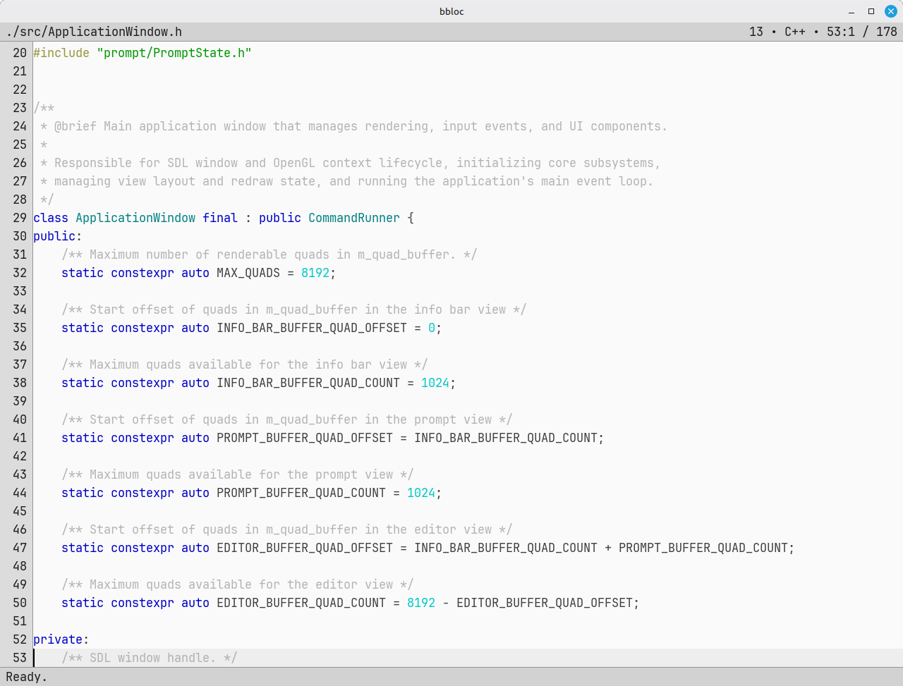
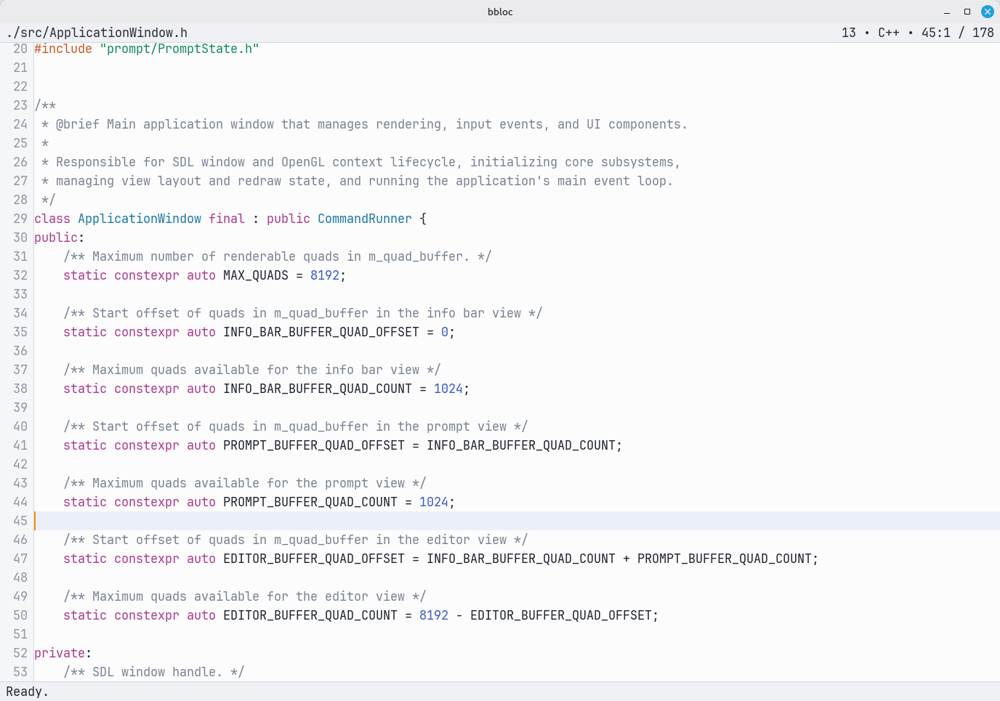
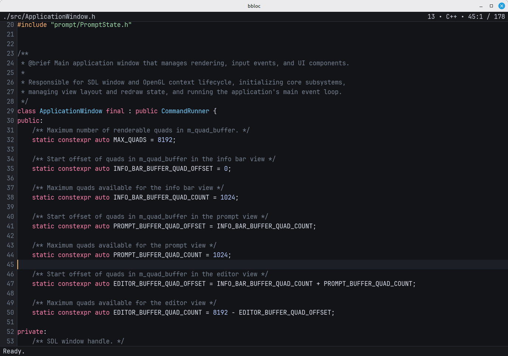

# bbloc

bbloc is a minimalist text editor developed in C++ using SDL2, OpenGL, glad, Freetype, utfcpp, and tree-sitter. It features a command-driven interface, syntax highlighting, and a layered UI with real-time configuration via CVars.

## Table of Contents

- [Features](#features)
- [Concept](#concept)
- [Architecture](#architecture)
- [UI Components](#ui-components)
- [Key Bindings](#key-bindings)
- [Commands](#commands)
- [CVars](#cvars)
- [Dependencies](#dependencies)
- [Building](#building)
- [Screenshots](#screenshots)

## Features

- **Syntax Highlighting**: Built on tree-sitter for C++ and JSON syntax highlighting (more to come)
- **Command-Driven Interface**: Execute operations via text commands with auto-completion
- **Real-Time Configuration**: Change colors, dimensions, and settings at runtime
- **Customizable Key Bindings**: Rebind any key combination to commands

## Concept

The application window is divided into three distinct areas:

### Top Bar (InfoBar)
Displays information about the current text buffer:
- Cursor position (line, column)
- Current syntax highlight mode
- Font size settings
- File information

### Center Area (Editor)
The main text editing area featuring:
- Syntax-highlighted text rendering
- Line numbers display
- Cursor tracking and movement
- Selection support
- Scrollable content

### Bottom Bar (Prompt)
An interactive command-line interface serving as both:
- Command input/output console
- Status bar for feedback messages
- Auto-completion interface for commands and files

### Command System
Every action beyond basic text typing is implemented as a command. The prompt allows executing commands using text input. By default, the key combination `Ctrl+Shift+space` opens the prompt for command entry.

### Key Bindings
Actions can be mapped to keystrokes using the `bind` command. The editor includes comprehensive default key bindings covering navigation, editing, and system operations.

## Architecture

### Core Components

#### Command System
- **Command Pattern**: Template-based command implementation with `Command<TPayload>`
- **CommandManager**: Central registry managing command execution and auto-completion
- **CommandRunner Interface**: Abstract interface for command execution from different contexts
- **CommandFeedback**: Interactive confirmation system for user prompts (e.g., "Overwrite? [y/n]")

#### Configuration Variables (CVar)
- **Type-Safe Storage**: Support for int32_t, bool, float, and Color types
- **Runtime Modification**: Change configuration at runtime through the command prompt
- **Callback System**: Reactive updates when CVars change

#### Cursor Management
- **TextBuffer**: Interface for text storage operations
- **Cursor**: Manages caret location, insert/delete operations, and selection
- **PromptCursor**: Specialized cursor for command prompt input
- **BufferEdit**: Data structure returned after edits for syntax highlighting updates

#### Syntax Highlighting
- **Tree-sitter Integration**: Parse text for syntax patterns
- **Language Parsers**: Support for C++ (tree-sitter-cpp) and JSON (tree-sitter-json)
- **Dynamic Switching**: Change highlight modes based on file extensions
- **Real-time Updates**: Re-parse incrementaly changed text segments

#### Theme System
- **Font Rendering**: FreeType-based glyph atlas generation and caching
- **Color Configuration**: Runtime-modifiable UI and syntax colors
- **Dimension Settings**: Layout dimensions (padding, borders, tabs, scroll amounts)
- **Texture Atlas**: Layered texture storage with naive packing algorithm

#### Renderer
- **OpenGL Integration**: Dynamic function loading via glad
- **Batched Quad Rendering**: Efficient vertex buffer rendering with QuadBuffer
- **Shader System**: Custom QuadProgram for textured quad rendering
- **Orthogonal Projection**: Coordinate system for UI layout

#### Views
- **View Pattern**: Base class with common rendering and input handling
- **View Subclasses**: InfoBar, Editor, and Prompt implementations
- **Focus Management**: Handles focus switching between Editor and Prompt
- **State Management**: ViewState hierarchy for view-specific state

#### Application Window
- **Lifecycle Management**: SDL window creation and OpenGL context handling
- **Event Loop**: SDL event processing and input routing
- **Rendering Pipeline**: Coordination of view rendering and syntax parsing
- **Command Integration**: Connects CommandRunner with UI and state

### Data Flow

1. **User Input**: SDL events routed to focused view (Editor or Prompt)
2. **Command Processing**: CommandManager executes registered commands
3. **State Updates**: CVars and theme attributes reflect changes
4. **Rendering**: Views render based on current state and syntax highlighting
5. **Feedback**: Prompts and status messages communicate to user

### Design Patterns

- **Command Pattern**: For operations and actions
- **Singleton-like**: Global Theme and CommandManager instances
- **Observer Pattern**: CVars and callbacks for reactive updates
- **Factory Pattern**: Lazy glyph generation and command instantiation
- **Template Method**: TypedCVar for type-safe configuration
- **Registry Pattern**: Centralized storage for commands and CVars

## UI Components

### View Hierarchy

```
ApplicationWindow
├── InfoBar (InfoBarState)
├── Editor (EditorState)
└── Prompt (PromptState)
```

### View Layout

- **InfoBar**: Top bar, occupies top portion of window
- **Prompt**: Bottom bar, occupies bottom portion of window
- **Editor**: Central area, fills remaining space between bars

### Focus Management

- Default focus on Editor
- `activate_prompt` command switches focus to Prompt
- Return/Enter in prompt switches back to Editor
- Escape in prompt switches back to Editor
- Commands from prompt reset focus to Editor

## Key Bindings

### Navigation
| Keys | Command | Description |
|------|---------|-------------|
| Escape | cancel | Cancel current action (e.g., close prompt) |
| Down | move down | Move cursor down one line |
| Shift+Down | move down true | Move down with text selection |
| Left | move left | Move cursor left one character |
| Shift+Left | move left true | Move left with selection |
| Right | move right | Move cursor right one character |
| Shift+Right | move right true | Move right with selection |
| Home | move bol | Move to beginning of line |
| Shift+Home | move bol true | Select to beginning of line |
| End | move eol | Move to end of line |
| Shift+End | move eol true | Select to end of line |
| PageUp | move page_up | Move up one page |
| Shift+PageUp | move page_up true | Select page up |
| PageDown | move page_down | Move down one page |
| Shift+PageDown | move page_down true | Select page down |

### Editing
| Keys | Command | Description |
|------|---------|-------------|
| Ctrl+C | copy | Copy selection to clipboard |
| Ctrl+X | cut | Cut selection to clipboard |
| Ctrl+V | paste | Paste from clipboard |
| Tab | auto_complete forward | Auto-complete input forward |
| Shift+Tab | auto_complete backward | Auto-complete input backward |

### System
| Keys | Command | Description |
|------|---------|-------------|
| Ctrl+T | cvar inf_draw_time | Display max render time |
| Ctrl+Shift+T | reset_draw_time | Reset render time to 0 |
| Ctrl+Y | cvar inf_command_time | Display max command time |
| Ctrl+Shift+Y | reset_command_time | Reset command time to 0 |
| Ctrl+Keypad+ | set_font_size + | Increase font size by 1 |
| Ctrl+Keypad- | set_font_size - | Decrease font size by 1 |
| Ctrl+Shift+S | save | Save current buffer to file |
| Ctrl+Shift+Space | activate_prompt | Open command prompt |
| Ctrl+Shift+Q | quit | Quit application (no save) |

## Commands

### File Operations
| Command | Arguments | Description |
|---------|-----------|-------------|
| `open <filename>` | filename | Open file in editor, sets highlight mode by extension |
| `save <filename> -f` | filename, -f | Save buffer with optional overwrite flag |
| `quit` | - | Exit application without saving |
| `exec <filename>` | filename | Execute commands from file line by line |

### Configuration
| Command | Arguments | Description |
|---------|-----------|-------------|
| `cvar <name> [value1] [value2] ...` | cvar name, values | Print/set CVar value |
| `reset_render_time` | - | Reset render time CVar to 0 |
| `reset_command_time` | - | Reset command time CVar to 0 |
| `set_font_size <size>` | size, +, - | Set font size (absolute or relative) |
| `set_hl_mode <mode>` | mode | Set syntax highlight mode (cpp, json, etc.) |
| `bind <modifiers>+<modifiers> <key> "<command>"` | modifiers, key, command | Bind key to command |

### Cursor
| Command | Arguments | Description |
|---------|-----------|-------------|
| `move <direction> <expand_selection>` | direction, bool | Move cursor (up/down/left/right/bol/eol/bof/eof/page_up/page_down) |

### System
| Command | Arguments | Description |
|---------|-----------|-------------|
| `activate_prompt` | - | Open command prompt |
| `copy` | - | Copy selection to clipboard |
| `paste` | - | Paste from clipboard |
| `cut` | - | Cut selection to clipboard |
| `auto_complete <direction>` | direction | Provide command/argument completion |

### Auto-Completion
- Commands: Type command name and press Tab
- Arguments: Type command with incomplete argument and press Tab
- File paths: Type `open` or `save` with filename and press Tab

## CVars

### System
| Variable | Type | Description |
|----------|------|-------------|
| `tab_to_space` | bool | Insert tab or spaces up to `dim_tab_to_space` |

### Read-Only Metrics
| Variable | Type | Description |
|----------|------|-------------|
| `inf_render_time` | float | Maximum render time in seconds (reset-able) |
| `inf_command_time` | float | Maximum command processing time (reset-able) |

### Theme Colors
| Variable | Type | Description |
|----------|------|-------------|
| `col_margin_background` | Color | Margin background color |
| `col_info_bar_background` | Color | Info bar background color |
| `col_editor_background` | Color | Editor background color |
| `col_prompt_background` | Color | Prompt background color |
| `col_line_background` | Color | Current line highlight color |
| `col_selected_text_background` | Color | Selected text background |
| `col_line_number` | Color | Line number color |
| `col_info_bar_text` | Color | Info bar text color |
| `col_prompt_text` | Color | Prompt text color |
| `col_prompt_input_text` | Color | Prompt input text color |
| `col_border` | Color | Border color |
| `col_cursor_indicator` | Color | Cursor indicator color |

### Highlight Colors
| Variable | Type | Description |
|----------|------|-------------|
| `hl_comment` | Color | Comment syntax color |
| `hl_string` | Color | String syntax color |
| `hl_preprocessor` | Color | Preprocessor syntax color |
| `hl_number` | Color | Number syntax color |
| `hl_keyword` | Color | Keyword syntax color |
| `hl_statement` | Color | Statement syntax color |

### Dimensions
| Variable | Type | Description |
|----------|------|-------------|
| `dim_padding_width` | int | Padding width in pixels |
| `dim_indicator_width` | int | Indicator width in pixels |
| `dim_border_size` | int | Border size in pixels |
| `dim_tab_to_space` | int | Spaces per tab character |
| `dim_page_up_down` | int | Lines per page scroll |
| `dim_font_size` | int | Font size in pixels (runtime) |

### Usage
- Get value: `cvar <name>`
- Set value: `cvar <name> <value>`
- Example: `cvar col_editor_background 250 250 250 255`

## Dependencies

### Core Libraries
- **SDL2**: Input handling and window management
- **OpenGL 4.3+**: Graphics rendering
- **glad**: Dynamic OpenGL function loader
- **Freetype**: Font glyph rendering
- **utfcpp**: UTF-8/UTF-16 string conversion

### Syntax Highlighting
- **tree-sitter**: General parser framework
- **tree-sitter-cpp**: C/C++ language parser
- **tree-sitter-json**: JSON language parser

### Fonts
- **JetBrains Mono**: Default font included in repository

## Building

### Linux (VCPKG + CLion)
1. Import project in CLion
2. Configure VCPKG as toolchain
3. Import necessary libraries from VCPKG
4. To run it, set working directory to `$ProjectFileDir$`
5. Compile and debug

### Nintendo Switch (Manual Build)
Requires:
- devkitpro
- devkitA64
- SDL2 with specific patch
- Manual compilation of utfcpp, tree-sitter, and parsers

Note: Game controller and IME not yet supported. USB keyboard partially supported.

```bash
mkdir nx && cd nx
source $DEVKITPRO/switchvars.sh
cmake -G"Unix Makefiles" -DCMAKE_C_FLAGS="$CFLAGS $CPPFLAGS" -DCMAKE_TOOLCHAIN_FILE=/opt/devkitpro/cmake/Switch.cmake ..
make
```

## Screenshots

**Default Theme**


**Light Theme**


**Dark Theme**


## Technical Implementation Details

### Rendering Pipeline
- OpenGL 4.6 (4.3 on Nintendo Switch) Core profile with double-buffered rendering
- Batched quad rendering via QuadBuffer (8192 quads capacity)
- Custom QuadProgram shader for textured quad drawing
- Orthogonal projection matrix for UI coordinates
- Scissor test to confine rendering per view

### Texture Atlas
- FreeType-generated layered glyph atlas (256x256x256 pixels)
- Lazy glyph loading (generated on-demand)
- AtlasArray for tracking character positions and layers

### Performance Optimization
- Texture atlas caching for glyphs
- Batched rendering (single draw call per view)
- Delta time calculation via high-resolution performance counters
- Metrics tracking for render and command times

### UTF-8/UTF-16 Conversion
- utfcpp library for bidirectional string conversion
- Consistent use of UTF-16 internally for prompt system
- UTF-8 for file I/O operations

### State Management
- Single-threaded event loop architecture
- CursorContext for runtime cursor state
- ViewState hierarchy for view-specific data
- FocusTarget for input routing
- CommandFeedback for interactive prompts

### Error Handling
- Optional error messages from command execution
- Type conversion validation in CVar operations
- Exception handling for initialization failures
- Graceful handling of malformed input

## Project Status

### Implemented
- Text editing with cursor management
- Syntax highlighting (C++, JSON)
- Command-driven interface with auto-completion
- Real-time CVar configuration
- Customizable key bindings
- Tab handling (space expansion)
- Selection and clipboard operations

### Known Limitations
- Tab alignment may not be perfect with mixed spaces
- Basic error handling
- No undo/redo support

### Future Enhancements (no ordering)
- Inline documentation needs improvement, to be re-done
- Code base need a good cleanup as there is a lots of comments all over the place
- Undo/Redo system
- Additional language support
- Search/Replace
- Better keyboard layouts for Nintendo Switch
- Better tab alignment ?

## Contributing

This is a hobby project. Contriution are not yet open (code cleanup are more than necessary before).
If you use it on Nintendo Switch and see bugs, reporting them are welcome.
