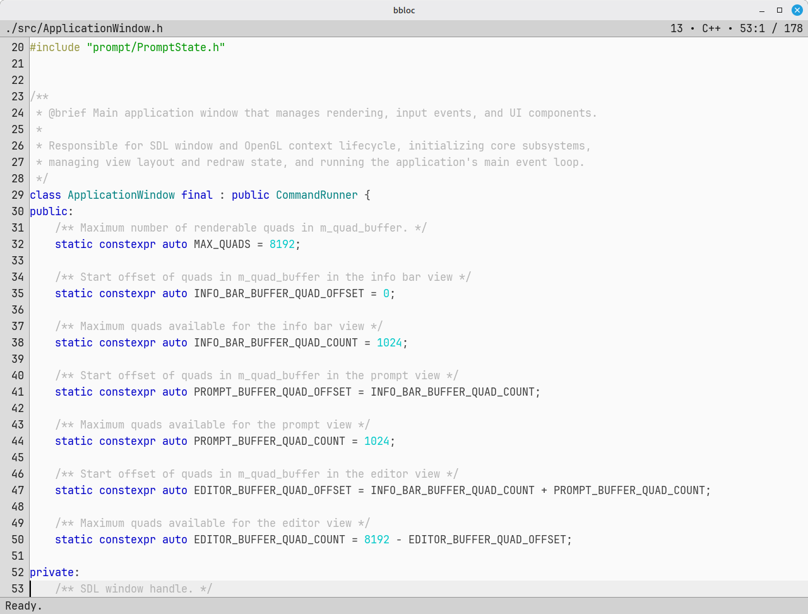
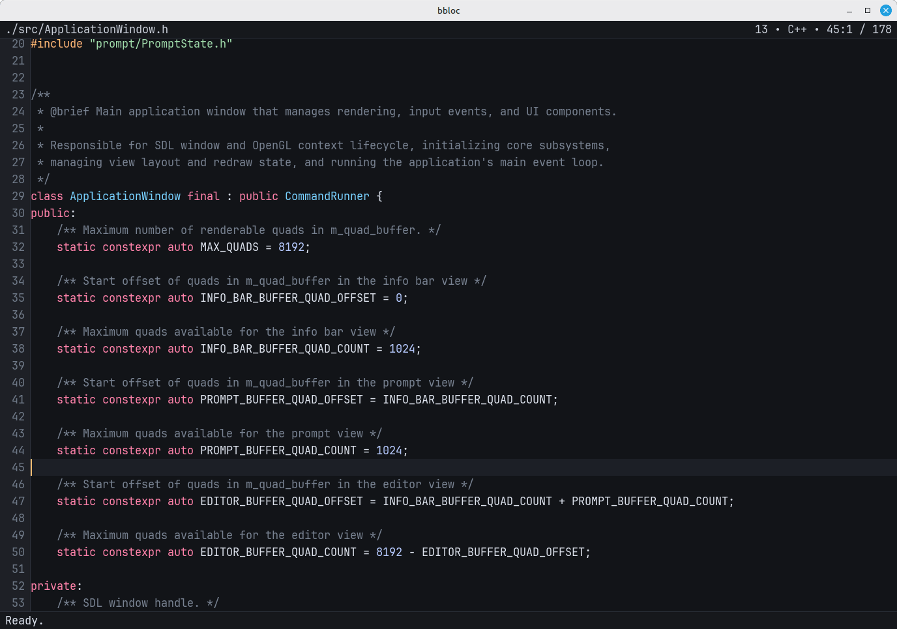

# bbloc

bbloc is a minimalist text editor developed in C++ using SDL2, OpenGL, glad, Freetype, utfcpp, and tree-sitter, targeting Linux and the Nintendo Switch (homebrew). It features a command-driven interface, syntax highlighting, and a layered UI with real-time configuration via CVars, controllable by keyboard, mouse, touch, or game controller.

## Table of Contents

- [Features](#features)
- [Concept](#concept)
- [Architecture](#architecture)
- [UI Components](#ui-components)
- [User Documentation](#user-documentation)
- [Dependencies](#dependencies)
- [Building](#building)
- [Screenshots](#screenshots)

## Features

- **Syntax Highlighting**: Built on tree-sitter for C++, JSON, INI, YAML, TOML, and Markdown syntax highlighting (more to come)
- **Command-Driven Interface**: Execute operations via text commands with auto-completion
- **Multiple Buffers**: Open several files at once and switch between them with the `buffer` command; opening an already-open file switches to its buffer instead of loading a second copy
- **Real-Time Configuration**: Change colors, dimensions, and settings at runtime
- **Customizable Key Bindings**: Rebind any key combination to commands
- **Mouse & Touch Support**: Click to place the caret, drag to select text, wheel scrolling, and draggable scrollbar thumbs; one finger acts as the mouse, two fingers scroll
- **Game Controller Support**: Every pad button and axis can be bound to commands like a key, with the shoulders acting as modifier layers
- **On-Screen Keyboard**: A built-in OSK with sticky modifiers, hold auto-repeat, and international layouts — usable by touch, mouse, or pad

## Concept

The application window is divided into three distinct areas (plus an optional on-screen keyboard strip):

### Top Bar (InfoBar)
Displays information about the active text buffer:
- Cursor position (line, column)
- Current syntax highlight mode
- Font size settings
- File information
- Buffer position (e.g. `[2/3]`) when several buffers are open
- Unsaved-changes marker (`*` after the file name) when the buffer is modified

### Center Area (Editor)
The main text editing area featuring:
- Syntax-highlighted text rendering
- Line numbers display
- Cursor tracking and movement
- Selection support
- Scrollable content
- Optional scrollbars (`cvar show_scrollbar true|false`), shown only when content overflows, with draggable thumbs

### Bottom Bar (Prompt)
An interactive command-line interface serving as both:
- Command input/output console
- Status bar for feedback messages
- Auto-completion interface for commands and files

### On-Screen Keyboard (Osk)
An optional keyboard strip at the bottom of the window (`osk show|hide|toggle`), designed for the Switch but available everywhere:
- Two key pages sharing one 5-row geometry; sticky Ctrl/Shift/Alt/AltGr keys latch on tap and hold on long-press
- Tapped keys synthesize regular key and text events, so shortcuts (e.g. sticky Ctrl + T) work exactly like a physical keyboard
- Hold auto-repeat on repeatable keys
- International layouts (`osk layout <name>`): qwerty, azerty, qwertz, uk, spanish, spanish_latin, italian, portuguese, russian
- Driven by touch, mouse, or pad (d-pad/A move and press a key cursor, B hands control back to the editor)

### Command System
Every action beyond basic text typing is implemented as a command. The prompt allows executing commands using text input. By default, the key combination `Ctrl+Shift+space` opens the prompt for command entry.

### Key Bindings
Actions can be mapped to keystrokes using the `bind` command. The editor includes comprehensive default key bindings covering navigation, editing, and system operations.

## Architecture

### Core Components

#### Command System
- **Command Pattern**: Template-based command implementation with `Command<TPayload>`
- **CommandManager**: Central registry managing command execution and auto-completion
- **CommandRunner Interface**: Abstract interface for command execution from different contexts
- **CommandFeedback**: Interactive prompts for commands needing more input — confirmations (e.g., "Overwrite? [y/n]") or a follow-up argument with Tab completion (e.g., a file path for `open`)

#### Configuration Variables (CVar)
- **Type-Safe Storage**: Support for int32_t, bool, float, and Color types
- **Runtime Modification**: Change configuration at runtime through the command prompt
- **Callback System**: Reactive updates when CVars change

#### Cursor Management
- **TextBuffer**: Interface for text storage operations
- **Cursor**: Manages caret location, insert/delete operations, and selection
- **PromptCursor**: Specialized cursor for command prompt input
- **BufferEdit**: Data structure returned after edits for syntax highlighting updates

#### Syntax Highlighting
- **Tree-sitter Integration**: Parse text for syntax patterns
- **Language Parsers**: Support for C++ (tree-sitter-cpp), JSON (tree-sitter-json), INI (tree-sitter-ini), YAML (tree-sitter-yaml), TOML (tree-sitter-toml), and Markdown (tree-sitter-markdown, block grammar)
- **Dynamic Switching**: Change highlight modes based on file extensions
- **Real-time Updates**: Re-parse incrementaly changed text segments

#### Theme System
- **Font Rendering**: FreeType-based glyph atlas generation and caching
- **Color Configuration**: Runtime-modifiable UI and syntax colors
- **Dimension Settings**: Layout dimensions (padding, borders, tabs, scroll amounts)
- **Texture Atlas**: Layered texture storage with naive packing algorithm

#### Renderer
- **OpenGL Integration**: Dynamic function loading via glad
- **Two Backends**: `QuadBuffer`/`QuadProgram`/`QuadTexture` have one header and two CMake-selected implementations — `gl45/` (OpenGL 4.5 direct state access, desktop) and `gl43/` (bind-based, Nintendo Switch)
- **Batched Quad Rendering**: Each view stages one batch CPU-side and draws it immediately; the batch may be drawn in more than one call when parts of it need different scissor boxes
- **Shader System**: Custom QuadProgram for textured quad rendering, one instanced draw per call
- **Orthogonal Projection**: Coordinate system for UI layout

#### Views
- **View Pattern**: Base class with common rendering and input handling
- **View Subclasses**: InfoBar, Editor, Prompt, and Osk implementations
- **Focus Management**: `FocusTarget` has exactly two values, Editor and Prompt, and tracks the keyboard only; whether the OSK owns the game pad is a separate flag on `OskState`
- **State Management**: ViewState hierarchy for view-specific state

#### Input Routing
- **KeyboardInput**: Dispatches keys to the focused view, falling back to the key bindings; Ctrl/Alt chords skip the view and go straight to the bindings
- **PointerInput**: Mouse buttons, motion, wheel, and touch fingers — one finger emulates the left button, two fingers scroll
- **ControllerInput**: Pad buttons and axes encoded as `pad:*` pseudo-keycodes, dispatched through the same binding table; the shoulders act as the L/R modifier layers
- **InputRepeater**: Deadline-based hold auto-repeat, shared by the pad and the OSK

#### Application Window
- **Lifecycle Management**: SDL window creation and OpenGL context handling
- **Event Loop**: SDL event processing and input routing
- **Rendering Pipeline**: Coordination of view rendering and syntax parsing
- **Command Integration**: Connects CommandRunner with UI and state

### Data Flow

1. **User Input**: SDL events routed through the input classes (keyboard, pointer, controller) to the focused view or the key bindings
2. **Command Processing**: CommandManager executes registered commands
3. **State Updates**: CVars and theme attributes reflect changes
4. **Rendering**: Views render based on current state and syntax highlighting
5. **Feedback**: Prompts and status messages communicate to user

### Design Patterns

- **Command Pattern**: For operations and actions
- **Singleton-like**: Global Theme and CommandManager instances
- **Observer Pattern**: CVars and callbacks for reactive updates
- **Factory Pattern**: Lazy glyph generation and command instantiation
- **Template Method**: TypedCVar for type-safe configuration
- **Registry Pattern**: Centralized storage for commands and CVars

## UI Components

### View Hierarchy

```
ApplicationWindow
├── InfoBar (ViewState)
├── Editor (ViewState)
├── Prompt (PromptState)
└── Osk (OskState)
```

### View Layout

- **InfoBar**: Top bar, occupies top portion of window
- **Prompt**: Bottom bar, occupies bottom portion of window
- **Editor**: Central area, fills remaining space between bars
- **Osk**: Optional strip below the prompt while visible (`dim_osk_height` percent of the window); the editor and prompt shift up to make room

### Focus Management

- Default focus on Editor
- `activate_prompt` command switches focus to Prompt
- Return/Enter in prompt switches back to Editor
- Escape in prompt switches back to Editor
- Commands from prompt reset focus to Editor
- The Osk focus is pad-only: acquired on the first d-pad/A press while the OSK is visible, released with B or `osk hide` — the physical keyboard keeps editing the buffer throughout

## User Documentation

The full user reference — default key bindings, mouse/touch/controller input, the
on-screen keyboard, every command, and every CVar (colors, dimensions, settings) — lives
in the [user manual](./docs/manual.md). An ASCII mirror of it ships with the editor
(`romfs/manual.txt`) and opens with the `help` command (`help <section>` jumps to a
chapter).

## Dependencies

### Core Libraries
- **SDL2**: Input handling and window management
- **OpenGL 4.5** (4.3 on Nintendo Switch): Graphics rendering
- **glad**: Dynamic OpenGL function loader
- **Freetype**: Font glyph rendering
- **utfcpp**: UTF-8/UTF-16 string conversion

### Syntax Highlighting
- **tree-sitter**: General parser framework
- **tree-sitter-cpp**: C/C++ language parser
- **tree-sitter-json**: JSON language parser
- **tree-sitter-ini**: INI language parser
- **tree-sitter-yaml**: YAML language parser
- **tree-sitter-toml**: TOML language parser
- **tree-sitter-markdown**: Markdown language parser (block grammar)

### Fonts
- **JetBrains Mono**: Default font included in repository

## Building

### Linux (VCPKG + CLion)
1. Import project in CLion
2. Configure VCPKG as toolchain
3. Import necessary libraries from VCPKG
4. To run it, set working directory to `$ProjectFileDir$`
5. Compile and debug

### Nintendo Switch (Manual Build)
Requires:
- devkitpro
- devkitA64
- SDL2 with specific patch (`src/platform/SDL2-2.28.5.patch_usbkbd.diff`)
- Manual compilation of utfcpp, tree-sitter, and parsers

On Switch, the Joy-Cons drive the editor through the game controller bindings, text is typed on the built-in on-screen keyboard or the touchscreen, and a USB keyboard is partially supported. The light or dark theme is selected at startup from the console color set (system theme setting).

```bash
mkdir nx && cd nx
source $DEVKITPRO/switchvars.sh
cmake -G"Unix Makefiles" -DCMAKE_C_FLAGS="$CFLAGS $CPPFLAGS" -DCMAKE_TOOLCHAIN_FILE=/opt/devkitpro/cmake/Switch.cmake ..
make
```

## Screenshots

**Default Theme**


**Light Theme**


**Dark Theme**


## Technical Implementation Details

### Rendering Pipeline
- OpenGL 4.5 (4.3 on Nintendo Switch) Core profile with double-buffered rendering; the two backends are separate CMake-selected source sets (DSA on desktop, bind-based on Switch)
- Batched quad rendering via QuadBuffer: batches are staged CPU-side and uploaded per view, the GPU buffer starts at 8192 quads and grows on demand (no truncation)
- Custom QuadProgram shader for textured quad drawing
- Orthogonal projection matrix for UI coordinates
- Scissor test to confine rendering per view

### Texture Atlas
- FreeType-generated layered glyph atlas (255x255x255 pixels, the `uint8_t` coordinate range)
- Lazy glyph loading (generated on-demand)
- AtlasArray for tracking character positions and layers

### Performance Optimization
- Texture atlas caching for glyphs
- Batched rendering: one staged batch per view, drawn in one call — except the Editor, which splits its batch in two so the text can be scissored away from the margin and the scrollbars
- Delta time calculation via high-resolution performance counters
- Metrics tracking for render and command times

### UTF-8/UTF-16 Conversion
- utfcpp library for bidirectional string conversion
- Consistent use of UTF-16 internally for prompt system
- UTF-8 for file I/O operations

### State Management
- Single-threaded event loop architecture
- CursorContext for runtime cursor state, one per open buffer, managed by CursorContextManager (views render the active one)
- ViewState hierarchy for view-specific data
- FocusTarget for input routing
- CommandFeedback for interactive prompts

### Error Handling
- Optional error messages from command execution
- Type conversion validation in CVar operations
- Exception handling for initialization failures
- Graceful handling of malformed input

## Project Status

### Implemented
- Text editing with cursor management
- Syntax highlighting (C++, JSON, INI, YAML, TOML, Markdown)
- Command-driven interface with auto-completion
- Real-time CVar configuration
- Customizable key bindings
- Tab handling (space expansion)
- Selection and clipboard operations
- Undo/redo (linear, storing the text each edit replaced rather than whole-buffer snapshots, 64 steps deep)
- Multiple open buffers with per-buffer scroll, search, undo, and highlight state
- Dirty-flag tracking with close/quit confirmation on unsaved changes
- Mouse support: caret placement, drag selection, wheel scrolling, and scrollbar interactions
- Touch support: single-finger caret/selection/taps, two-finger scrolling
- Game controller support with rebindable buttons/axes and shoulder modifier layers
- On-screen keyboard with sticky modifiers, hold auto-repeat, and international layouts

### Future Enhancements (no ordering)
- Additional language support

## Contributing

This is a hobby project. Contributions are not yet open.
If you use it on Nintendo Switch and see bugs, reporting them is welcome.

### Code Style

Code style is checked with clang-tidy ([.clang-tidy](./.clang-tidy)) on every commit through a pre-commit hook.
Activate the hook once after cloning:

```bash
git config core.hooksPath misc
```
