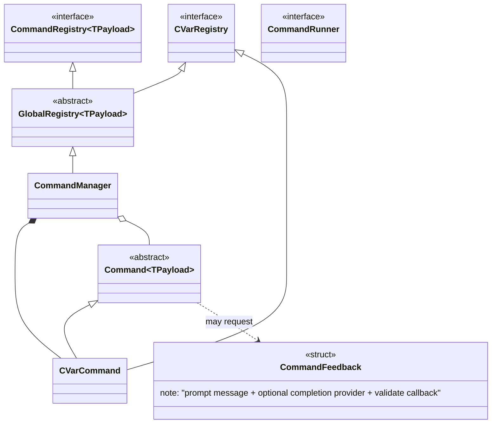
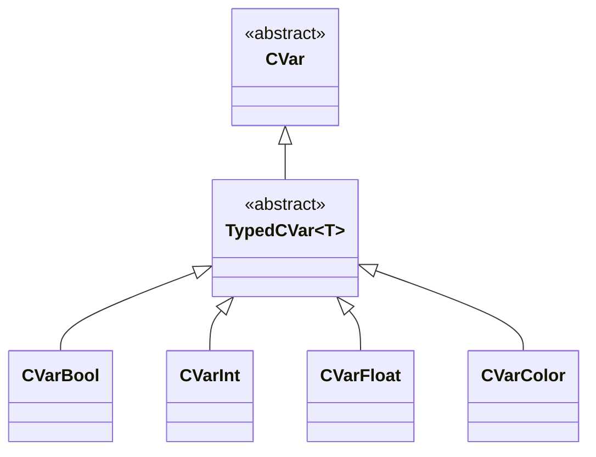
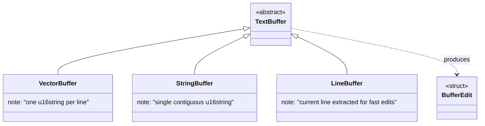
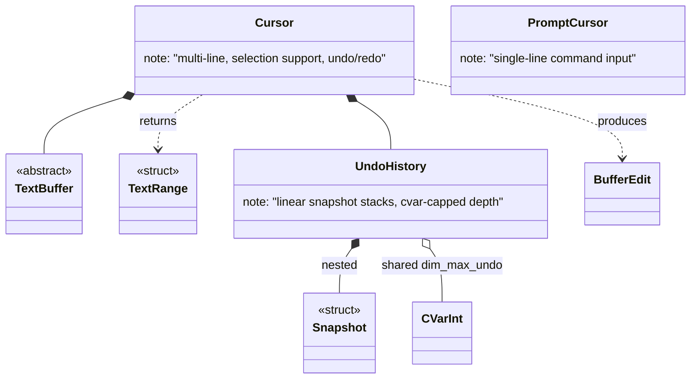
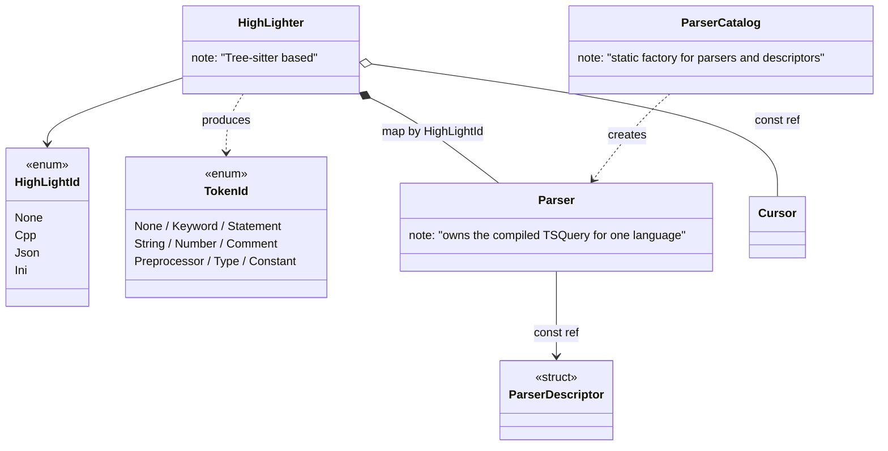
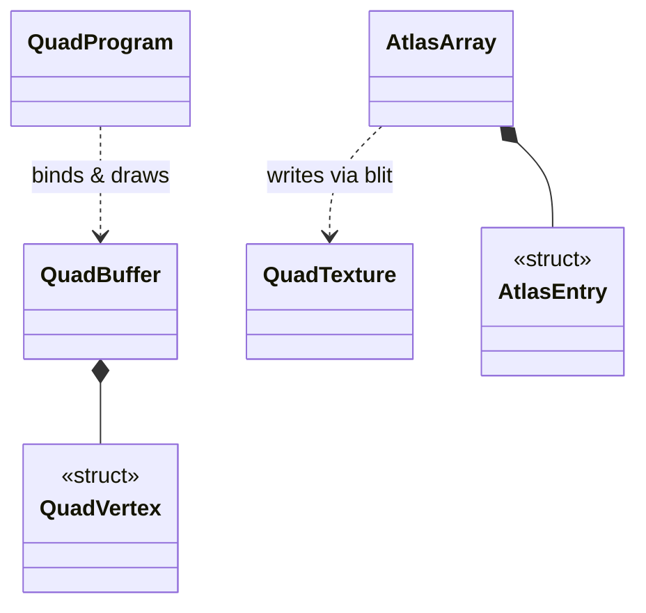
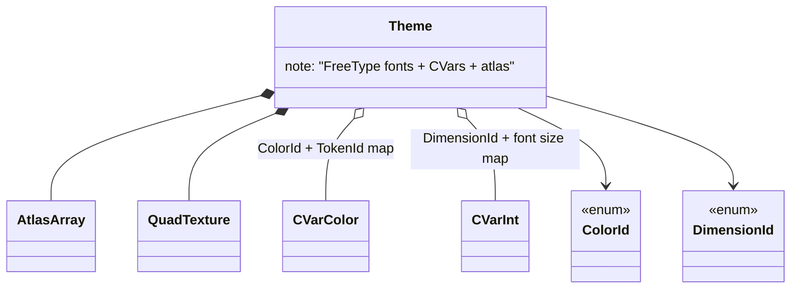
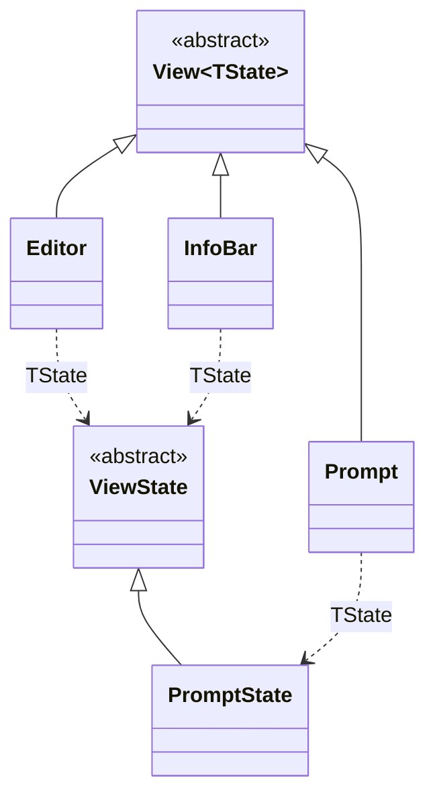
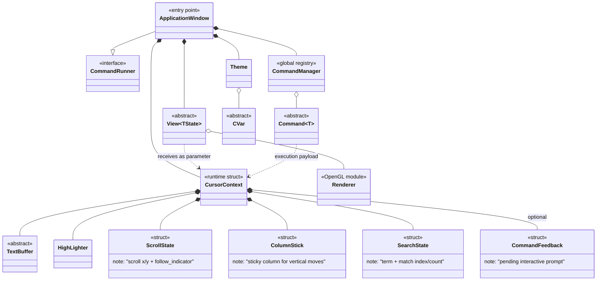

# Class Diagram — C++ Text Editor

---

## 1. Command System (`core/base` + `core/`)

---

## 2. Configuration Variables (`core/cvar`)

---

## 3. Text Buffers (`core/cursor/buffer`)

---

## 4. Cursors (`core/cursor`)

---

## 5. Syntax Highlighting (`core/highlighter`)

---

## 6. OpenGL Renderer (`core/renderer`)

---

## 7. Theme (`core/theme`)

---

## 8. Views & States (`core/` + `editor/` + `infobar/` + `prompt/`)

---

## 9. Concrete Commands (`command/`)

```mermaid
classDiagram
    class Command~CursorContext~ {
        <<abstract>>
    }
    class BindCommand
    class MoveCursorCommand
    class AutoCompleteCommand
    class ActivatePromptCommand
    class FontSizeCommand
    class ResetCVarFloatCommand
    class OpenFileCommand
    class SaveFileCommand
    class ExecCommand
    class QuitCommand
    class SetHighLightCommand
    class CopyTextCommand
    class CutTextCommand
    class PasteTextCommand
    class UndoCommand
    class RedoCommand
    class SearchCommand {
        note: "search / find_next / find_prev / replace / replace_all"
    }
    class GotoLineCommand

    Command~CursorContext~ <|-- BindCommand
    Command~CursorContext~ <|-- MoveCursorCommand
    Command~CursorContext~ <|-- AutoCompleteCommand
    Command~CursorContext~ <|-- ActivatePromptCommand
    Command~CursorContext~ <|-- FontSizeCommand
    Command~CursorContext~ <|-- ResetCVarFloatCommand
    Command~CursorContext~ <|-- OpenFileCommand
    Command~CursorContext~ <|-- SaveFileCommand
    Command~CursorContext~ <|-- ExecCommand
    Command~CursorContext~ <|-- QuitCommand
    Command~CursorContext~ <|-- SetHighLightCommand
    Command~CursorContext~ <|-- CopyTextCommand
    Command~CursorContext~ <|-- CutTextCommand
    Command~CursorContext~ <|-- PasteTextCommand
    Command~CursorContext~ <|-- UndoCommand
    Command~CursorContext~ <|-- RedoCommand
    Command~CursorContext~ <|-- SearchCommand
    Command~CursorContext~ <|-- GotoLineCommand
```

---

## 10. Global Overview

