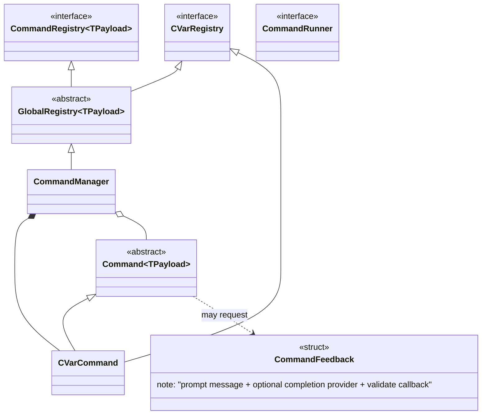
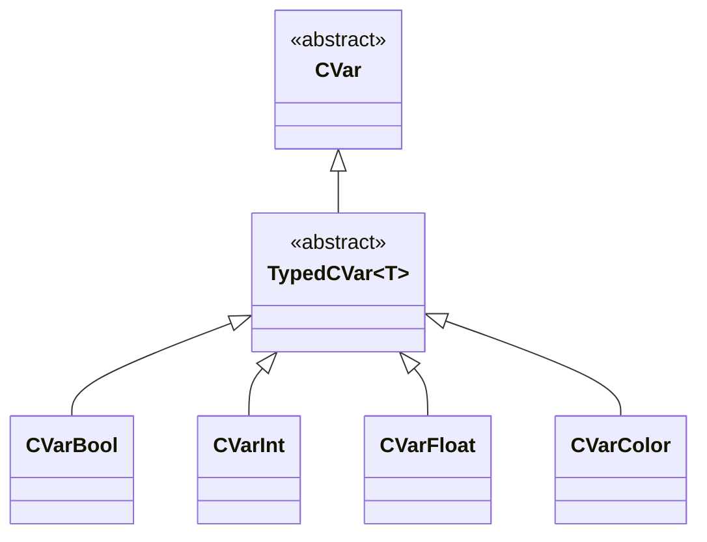
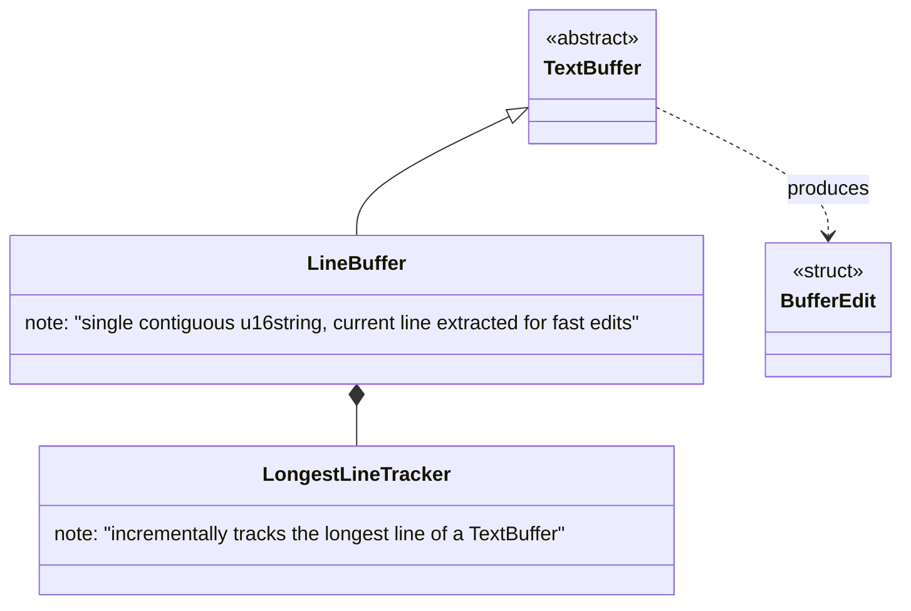
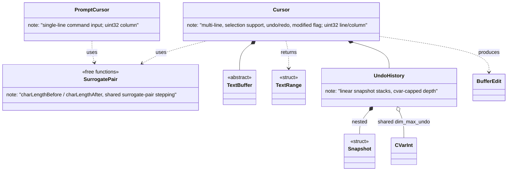
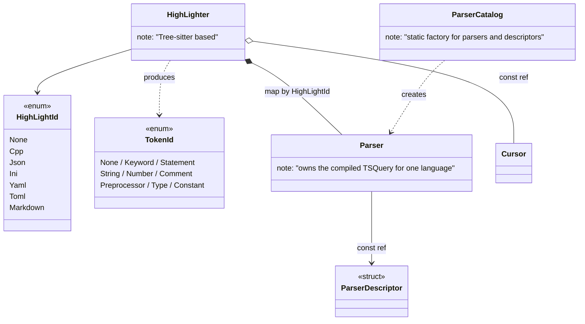
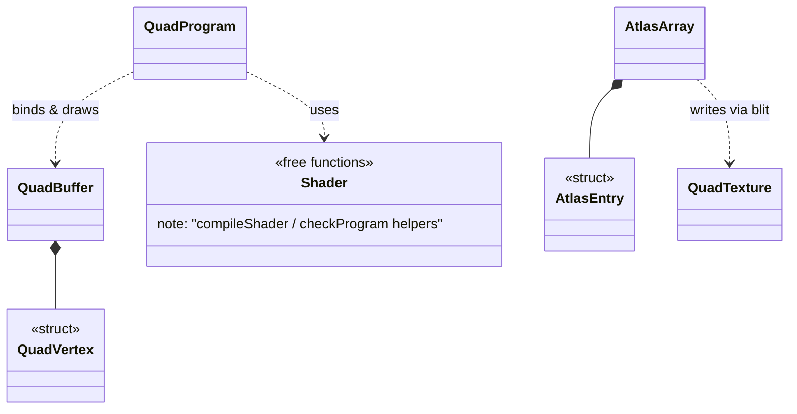
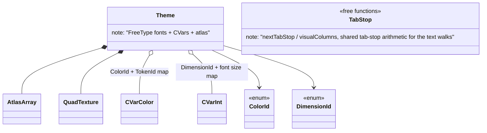

# Class Diagram — C++ Text Editor

---

## 1. Command System (`core/base` + `core/`)



---

## 2. Configuration Variables (`core/cvar`)



---

## 3. Text Buffers (`core/cursor/buffer`)



---

## 4. Cursors (`core/cursor`)



---

## 5. Syntax Highlighting (`core/highlighter`)



---

## 6. OpenGL Renderer (`core/renderer`)



The `QuadBuffer` / `QuadProgram` / `QuadTexture` headers live in `core/renderer/`; their
implementations exist twice, as CMake-selected source sets: `gl45/` (OpenGL 4.5 DSA, desktop)
and `gl43/` (bind-based GL 4.3, Nintendo Switch). Each set also ships a `GlBackend.h` exposing
the GL context version `ApplicationWindow` must request, supplied via a per-set include path.

---

## 7. Theme (`core/theme`)



---

## 8. Views, States & Input (`core/` + `editor/` + `infobar/` + `prompt/` + `input/`)

```mermaid
classDiagram
    class ViewState {
        <<abstract>>
        note: "int32 window rectangle (position + size)"
    }
    class PromptState
    class View~TState~ {
        <<abstract>>
        +render(context, viewState, quadBuffer, dt)*
        +onKeyDown(context, viewState, keyCode, keyModifier)*
        +onTextInput(context, viewState, text)*
        +onMouseDown(context, viewState, x, y)
        +onMouseMotion(context, viewState, x, y)
        +onMouseUp(context, viewState, x, y)
    }
    class Editor {
        note: "overrides the mouse handlers: caret placement, drag selection, scrollbar thumb drags and track page jumps"
    }
    class InfoBar
    class Prompt
    class Osk {
        note: "on-screen keyboard strip; injects synthesized SDL key/text events via SDL_PushEvent"
    }
    class OskState {
        note: "visibility, page, layout table, sticky modifiers, key cursor, hold repeat"
    }
    class OskLayout {
        note: "static-only hybrid layouts: fixed US base + letter permutation + AltGr accent map"
    }
    class QuadBuffer {
        note: "single shared instance, passed to render()"
    }
    class TabStop {
        <<free functions>>
    }
    class KeyboardInput {
        note: "SDL key/text events: chord detection, focused-view dispatch, binding fallback"
    }
    class PointerInput {
        note: "SDL mouse/wheel/touch events; owns the MouseTarget capture and TouchMode gesture state"
    }
    class ControllerInput {
        note: "SDL game-controller events: hotplug, shoulder L/R modifier mask, axis hysteresis, auto-repeat"
    }
    class PadInput {
        note: "static-only: negative pad pseudo-keycodes, KMOD_PAD_L/R bits, pad: name mapping"
    }
    class InputRepeater {
        note: "shared hold auto-repeat: delay/interval/deadline, opaque code + modifier mask"
    }

    ViewState <|-- PromptState
    ViewState <|-- OskState
    View~TState~ <|-- Editor
    View~TState~ <|-- InfoBar
    View~TState~ <|-- Prompt
    View~TState~ <|-- Osk
    Editor ..> ViewState : TState
    InfoBar ..> ViewState : TState
    Prompt ..> PromptState : TState
    Osk ..> OskState : TState
    Osk ..> OskLayout : labels + TEXTINPUT payloads
    OskState *-- InputRepeater
    ControllerInput *-- InputRepeater
    ControllerInput ..> Osk : d-pad/A/B while FocusTarget::Osk
    View~TState~ ..> QuadBuffer : stages one batch per render()
    Editor ..> TabStop : uses
    InfoBar ..> TabStop : uses
    Prompt ..> TabStop : uses
    KeyboardInput ..> View~TState~ : dispatches key/text to focused view
    PointerInput ..> View~TState~ : routes captured pointer events
    ControllerInput ..> PadInput : encodes pad inputs
```

The mouse handlers have empty default implementations; `InfoBar` and `Prompt` keep them.
`ApplicationWindow::mainLoop` delegates every keyboard, pointer, and game-controller event to
the three handlers in `src/input/`, keeping only quit and window events for itself.

`KeyboardInput` sends key presses to the focused view first — unless Ctrl/Alt makes them a
shortcut chord — then falls back to the key bindings through `CommandRunner::runBoundCommand`
(implemented by `ApplicationWindow`), which times the run into `inf_command_time` and returns
whether a bound command ran. Text input is routed to the focused view the same way, with
chords blocked.

`PointerInput` routes a left `SDL_MOUSEBUTTONDOWN` to the view whose rectangle contains the
point, then captures that view: `SDL_MOUSEMOTION` and `SDL_MOUSEBUTTONUP` keep going to it
until the button is released, even when the pointer leaves the view. Wheel events scroll the
active context directly.

Touch input goes through the same capture (SDL's touch-to-mouse synthesis is disabled): a
single finger replays the left-button press/drag/release path, while a second finger ends the
drag and switches to a two-finger scroll of the active context (the `TouchMode` enum owned by
`PointerInput`, like the `MouseTarget` capture state); scroll mode ends only when every finger
has lifted.

`ControllerInput` makes game controllers a first-class binding source: buttons and axis
directions are encoded as negative pad pseudo-keycodes (the static-only `PadInput` class in
`core/base/PadInput.h`, `pad:...` names in `bind`) and dispatched through
`CommandRunner::runBoundCommand`, exactly like keyboard shortcuts. The two shoulders are not
bindable: they build the live L/R modifier mask (`KMOD_PAD_L`/`KMOD_PAD_R`, the two KMOD bits
SDL leaves free, passed through by `BindCommand::normalizeModifiers`). Sticks and triggers act
as digital pseudo-buttons with press/release hysteresis, and a successfully dispatched press
arms an auto-repeat (delay then fast interval) that `mainLoop` honors by waiting with
`SDL_WaitEventTimeout` and ticking after the poll loop. Hotplug opens/closes the pads and a
disconnect resets the whole pad state; all connected pads feed one state, like a keyboard.

`Prompt` exposes its Return/Escape handling as `confirm()` / `cancel()`, which `onKeyDown`
delegates to; the hidden `prompt` command (`PromptCommand`, §9) drives the same entry points
from controller bindings.

`Osk` is the on-screen keyboard: a bottom strip of two key pages (letters/symbols) sharing
one 5-row geometry, shown and hidden by the `osk` command (§9). Injection, not integration:
key taps push synthesized `SDL_KEYDOWN`/`SDL_KEYUP` (scancode + keycode + the sticky
Ctrl/Shift/Alt/AltGr mask in `keysym.mod`) and `SDL_TEXTINPUT` for printables through
`SDL_PushEvent`, so bindings, chords, prompt, and editor input all work unchanged and
nothing downstream knows the OSK exists (no `SDL_TEXTINPUT` while Ctrl or Alt is latched).
Key labels and text come from the `OskLayout` hybrid layouts — one fixed US base (digits
always plain, punctuation always US) plus a per-layout letter permutation and an AltGr
accent column on mnemonic letters, the injected keycode following the displayed letter —
selected via `Platform::keyboardLayout()` and overridden by `osk layout`. While visible,
the relayout in
`mainLoop` gives the strip ~`dim_osk_height`% of the window through the normal resize path.
`PointerInput` routes presses inside the strip to it (taps never move the input focus);
sticky keys latch on tap, hold on long-press, and show a dot. The pad focus is acquired
lazily: the first d-pad/A press while the OSK is visible (and the editor focused) sets
`FocusTarget::Osk`, and from then on `ControllerInput` routes d-pad/A/B to the key cursor
instead of the bindings — B hands the focus back, so mouse and touch users never see the
key cursor; the physical keyboard always behaves like the editor focus. Every held
injecting key auto-repeats like a physical keyboard, re-emitting under the sticky mask
captured at press, through `InputRepeater` — the delay/interval state machine extracted
from `ControllerInput` and shared by both; `mainLoop` waits on the earliest armed deadline
and ticks both after the poll loop.

---

## 9. Concrete Commands (`command/`)

```mermaid
classDiagram
    class Command~CursorContext~ {
        <<abstract>>
    }
    class BindCommand {
        note: "keyboard keys and pad: names (via PadInput), L/R shoulder modifiers"
    }
    class MoveCursorCommand
    class AutoCompleteCommand
    class ActivatePromptCommand
    class PromptCommand {
        note: "prompt confirm / cancel, driving Prompt::confirm/cancel; no-op while the prompt is idle"
    }
    class OskCommand {
        note: "osk show / hide / toggle / layout <name>, driving OskState"
    }
    class FontSizeCommand
    class ResetCVarFloatCommand
    class OpenFileCommand {
        note: "activates the existing buffer when the file is already open, via CursorContextManager"
    }
    class SaveFileCommand
    class ExecCommand {
        note: "resolves the romfs/ prefix via Platform::assetPath"
    }
    class QuitCommand {
        note: "confirms when any open buffer is modified, via CursorContextManager"
    }
    class SetHighLightCommand
    class CopyTextCommand
    class CutTextCommand
    class PasteTextCommand
    class UndoCommand
    class RedoCommand
    class SearchCommand {
        note: "search / find_next / find_prev / replace / replace_all"
    }
    class GotoLineCommand
    class BufferCommand {
        note: "buffer next / prev / close / name, via CursorContextManager"
    }

    Command~CursorContext~ <|-- BindCommand
    Command~CursorContext~ <|-- MoveCursorCommand
    Command~CursorContext~ <|-- AutoCompleteCommand
    Command~CursorContext~ <|-- ActivatePromptCommand
    Command~CursorContext~ <|-- PromptCommand
    Command~CursorContext~ <|-- OskCommand
    Command~CursorContext~ <|-- FontSizeCommand
    Command~CursorContext~ <|-- ResetCVarFloatCommand
    Command~CursorContext~ <|-- OpenFileCommand
    Command~CursorContext~ <|-- SaveFileCommand
    Command~CursorContext~ <|-- ExecCommand
    Command~CursorContext~ <|-- QuitCommand
    Command~CursorContext~ <|-- SetHighLightCommand
    Command~CursorContext~ <|-- CopyTextCommand
    Command~CursorContext~ <|-- CutTextCommand
    Command~CursorContext~ <|-- PasteTextCommand
    Command~CursorContext~ <|-- UndoCommand
    Command~CursorContext~ <|-- RedoCommand
    Command~CursorContext~ <|-- SearchCommand
    Command~CursorContext~ <|-- GotoLineCommand
    Command~CursorContext~ <|-- BufferCommand
```



---

## 10. Global Overview

```mermaid
classDiagram
    class ApplicationWindow {
        <<entry point>>
    }
    class CommandRunner {
        <<interface>>
    }
    class CommandManager {
        <<global registry>>
    }
    class Theme
    class CursorContextManager {
        note: "owns all open contexts, one active; never empty"
    }
    class CursorContext {
        <<runtime struct>>
        note: "one per open file; buffer_index / buffer_count"
    }
    class Cursor
    class PromptCursor
    class ScrollState {
        <<struct>>
        note: "scroll x/y (int64 content-space pixels) + follow_indicator"
    }
    class ColumnStick {
        <<struct>>
        note: "sticky column for vertical moves"
    }
    class SearchState {
        <<struct>>
        note: "term + match index/count"
    }
    class CommandFeedback {
        <<struct>>
        note: "pending interactive prompt"
    }
    class View~TState~ {
        <<abstract>>
    }
    class Command~T~ {
        <<abstract>>
    }
    class TextBuffer {
        <<abstract>>
    }
    class CVar {
        <<abstract>>
    }
    class Renderer {
        <<OpenGL module>>
        note: "gl45 (DSA) or gl43 (bind-based) source set, selected by CMake"
    }
    class Platform {
        note: "static-only: assetPath / preferredColorScheme / keyboardLayout / addControllerMappings; Desktop or Switch impl selected by CMake"
    }
    class KeyboardInput
    class PointerInput
    class ControllerInput
    class HighLighter

    ApplicationWindow --|> CommandRunner
    ApplicationWindow ..> Platform : asset paths + startup color scheme
    ApplicationWindow *-- KeyboardInput
    ApplicationWindow *-- PointerInput
    ApplicationWindow *-- ControllerInput
    KeyboardInput ..> CommandRunner : runBoundCommand fallback
    ControllerInput ..> CommandRunner : runBoundCommand dispatch
    KeyboardInput ..> View~TState~ : dispatches to focused view
    PointerInput ..> View~TState~ : routes captured pointer events
    ApplicationWindow *-- CommandManager
    ApplicationWindow *-- Theme
    ApplicationWindow *-- PromptCursor
    ApplicationWindow *-- CursorContextManager
    ApplicationWindow *-- View~TState~
    CommandManager o-- Command~T~
    CursorContextManager *-- CursorContext : one per open file
    CursorContext *-- Cursor
    CursorContext o-- PromptCursor : shared ref
    CursorContext o-- Theme : shared ref
    Cursor *-- TextBuffer
    CursorContext *-- HighLighter
    CursorContext *-- ScrollState
    CursorContext *-- ColumnStick
    CursorContext *-- SearchState
    CursorContext *-- CommandFeedback : optional
    Theme o-- CVar
    View~TState~ o-- Renderer
    View~TState~ ..> CursorContext : receives as parameter
    Command~T~ ..> CursorContext : execution payload
```


