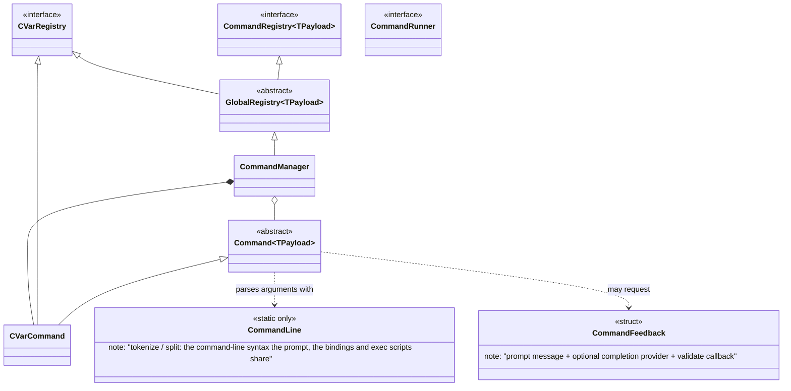
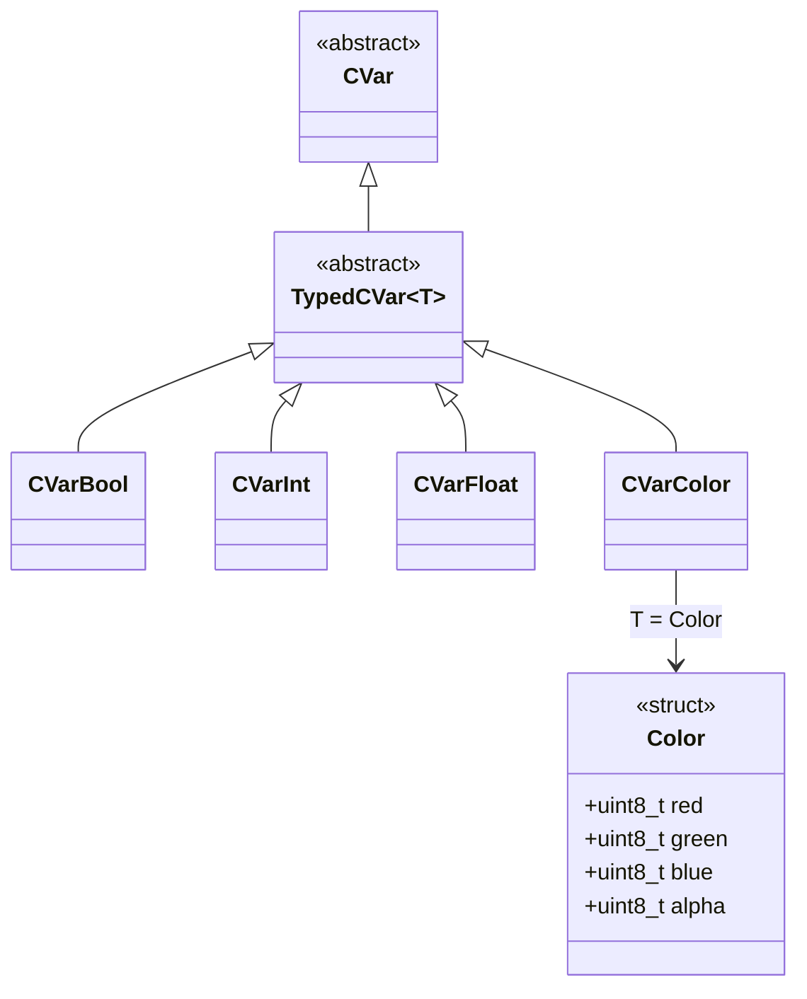
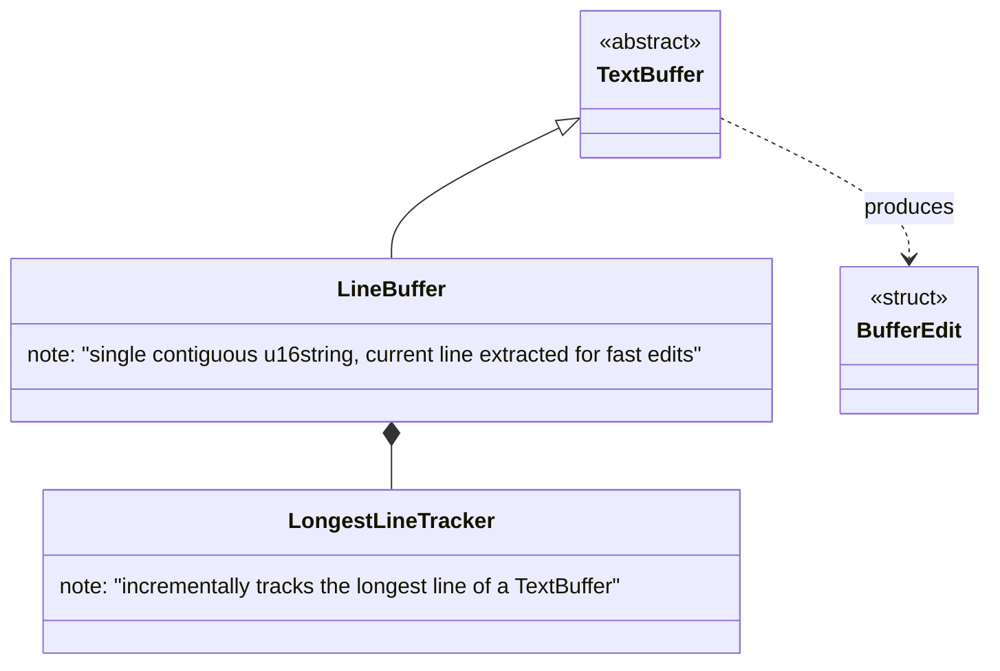
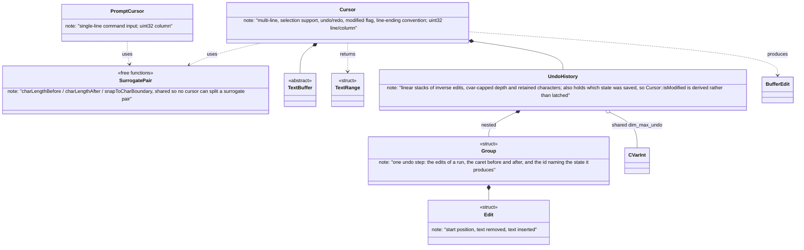
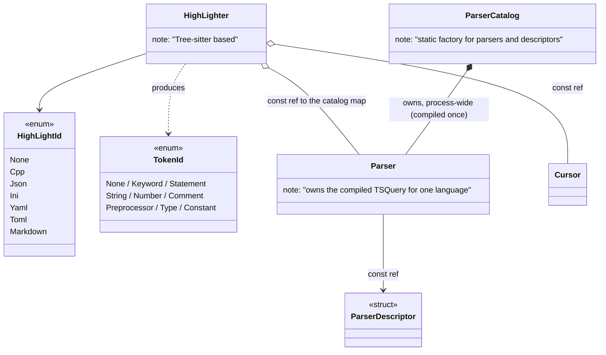
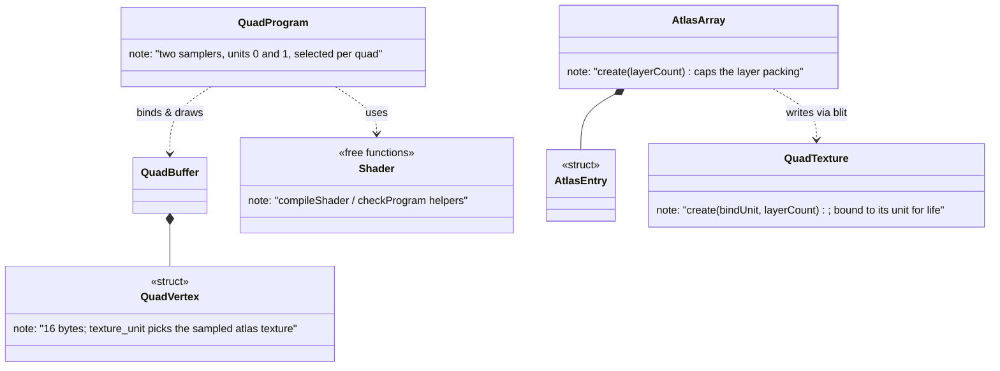
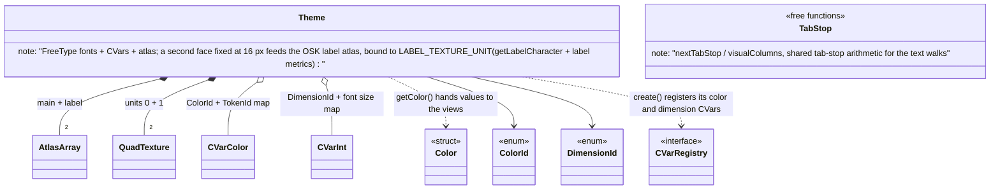
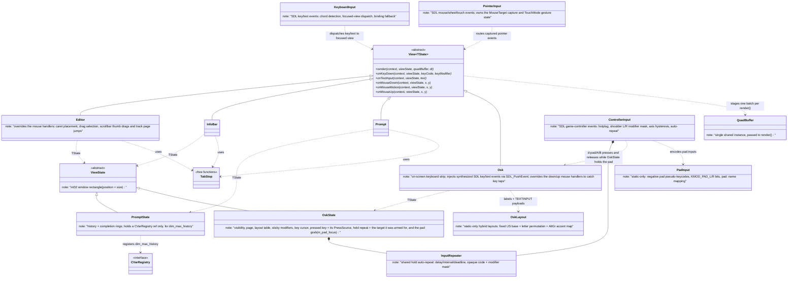

# Class Diagram — C++ Text Editor

---

## 1. Command System (`core/base` + `core/`)

---

## 2. Configuration Variables (`core/cvar`)

---

## 3. Text Buffers (`core/cursor/buffer`)

---

## 4. Cursors (`core/cursor`)

---

## 5. Syntax Highlighting (`core/highlighter`)

---

## 6. OpenGL Renderer (`core/renderer`)

The `QuadBuffer` / `QuadProgram` / `QuadTexture` headers live in `core/renderer/`; their
implementations exist twice, as CMake-selected source sets: `gl45/` (OpenGL 4.5 DSA, desktop)
and `gl43/` (bind-based GL 4.3, Nintendo Switch). Each set also ships a `GlBackend.h` exposing
the GL context version `ApplicationWindow` must request, supplied via a per-set include path.

Only the *version-dependent* GL lives in those sets. Calls identical in both core profiles are made
outside them: `glScissor` in the four views, the state setup and frame clear in `ApplicationWindow`,
and the shader helpers in `core/renderer/Shader.cpp`.

---

## 7. Theme (`core/theme`)

---

## 8. Views, States & Input (`core/` + `editor/` + `infobar/` + `prompt/` + `input/`)

The mouse handlers have empty default implementations, and each view keeps or overrides them
independently: `Editor` overrides all three, `Osk` overrides `onMouseDown` and `onMouseUp` only
(a key press needs a down and an up, never a drag), and `InfoBar` and `Prompt` keep all three.
`ApplicationWindow::mainLoop` delegates every keyboard, pointer, and game-controller event to
the three handlers in `src/input/`, keeping only quit and window events for itself.

`KeyboardInput` sends key presses to the focused view first — unless Ctrl/Alt makes them a
shortcut chord — then falls back to the key bindings through `CommandRunner::runBoundCommand`
(implemented by `ApplicationWindow`), which times the run into `inf_command_time` and returns
whether a bound command ran. Text input is routed to the focused view the same way, with
chords blocked.

`PointerInput` routes a left `SDL_MOUSEBUTTONDOWN` to the view whose rectangle contains the
point, then captures that view: `SDL_MOUSEMOTION` and `SDL_MOUSEBUTTONUP` keep going to it
until the button is released, even when the pointer leaves the view. Wheel events scroll the
active context directly.

Touch input goes through the same capture (SDL's touch-to-mouse synthesis is disabled): a
single finger replays the left-button press/drag/release path, while a second finger ends the
drag and switches to a two-finger scroll of the active context (the `TouchMode` enum owned by
`PointerInput`, like the `MouseTarget` capture state); scroll mode ends only when every finger
has lifted.

`ControllerInput` makes game controllers a first-class binding source: buttons and axis
directions are encoded as negative pad pseudo-keycodes (the static-only `PadInput` class in
`core/base/PadInput.h`, `pad:...` names in `bind`) and dispatched through
`CommandRunner::runBoundCommand`, exactly like keyboard shortcuts. The two shoulders are not
bindable: they build the live L/R modifier mask (`KMOD_PAD_L`/`KMOD_PAD_R`, the two KMOD bits
SDL leaves free, passed through by `KeyModifiers::normalize`). Sticks and triggers act
as digital pseudo-buttons with press/release hysteresis, and a successfully dispatched press
arms an auto-repeat (delay then fast interval) that `mainLoop` honors by waiting with
`SDL_WaitEventTimeout` and ticking after the poll loop. Hotplug opens/closes the pads and a
disconnect resets the whole pad state; all connected pads feed one state, like a keyboard.

`Prompt` exposes its Return/Escape handling as `confirm()` / `cancel()`, which `onKeyDown`
delegates to; the hidden `prompt` command (`PromptCommand`, §9) drives the same entry points
from controller bindings, and `activate_prompt` (`ActivatePromptCommand`, §9) reaches
`confirm()` too when the prompt it would open is already running — pad X opens the prompt and
then submits it.

`Osk` is the on-screen keyboard: a bottom strip of two key pages (letters/symbols) sharing
one 5-row geometry, shown and hidden by the `osk` command (§9). Injection, not integration:
key taps push synthesized `SDL_KEYDOWN`/`SDL_KEYUP` (scancode + keycode + the sticky
Ctrl/Shift/Alt/AltGr mask in `keysym.mod`) and `SDL_TEXTINPUT` for printables through
`SDL_PushEvent`, so bindings, chords, prompt, and editor input all work unchanged and
nothing downstream knows the OSK exists (no `SDL_TEXTINPUT` while Ctrl or Alt is latched).
Key labels are rasterized at a fixed 16 px from `Theme`'s dedicated label atlas
(`getLabelCharacter` and the label metrics, drawn through `View::drawCharacter` with
`Theme::LABEL_TEXTURE_UNIT`), so `dim_font_size` never changes them. Labels and text come from the `OskLayout` hybrid layouts — one fixed US base (digits
always plain, punctuation always US) plus a per-layout letter permutation and an AltGr
accent column on mnemonic letters, the injected keycode following the displayed letter —
selected via `Platform::keyboardLayout()` and overridden by `osk layout`. While visible,
the relayout in
`mainLoop` gives the strip ~`dim_osk_height`% of the window through the normal resize path.
`PointerInput` routes presses inside the strip to it (taps never move the input focus);
sticky keys cycle latched -> held -> idle on each press (a long press jumps straight to
held) and show a dot, wider when held. `ControllerInput` publishes the L
shoulder into `OskState` as a live Shift (`setLiveModifiers`), since the binding modifier
mask never reaches a view that emits key events instead of running bindings;
`effectiveModifierMask` ORs it with the sticky mask for both injection and label
resolution. The keyboard focus and the pad focus are two independent facts:
`CursorContext::focus_target` (`FocusTarget::Editor` or `FocusTarget::Prompt`) says where
typing goes, while `OskState::m_pad_focus` says whether the on-screen keyboard owns the
game pad — the grab belongs to the OSK, one object shared by every buffer, so it survives
a `buffer next`. It is taken lazily: the first d-pad/A press while the OSK is visible sets
it, and from then on `ControllerInput` routes d-pad/A/B to the key cursor instead of the
bindings, so mouse and touch users never see the key cursor. Pad B releases it (over an
active prompt it runs `prompt cancel` instead and keeps the pad, so one press closes the
prompt), and so does `osk hide` through `OskState::resetInteraction`. Taking the pad never
moves the keyboard focus: keys and text (physical or synthesized) keep going to the editor
or to an active prompt, so the OSK types into both.

Pointer and pad share one press/release state machine — `Osk::pressKey` /
`Osk::releaseKey`, reached from `onMouseDown`/`onMouseUp` and from `onPadDown`/`onPadUp`
— so pad A behaves exactly like a finger: it holds the key it pressed, repeats it while
held, and long-presses a sticky modifier straight into held. Because both can hold a key at
once, `OskState` records the `PressSource` that started the press and only that source's
release ends it. This is why `ControllerInput` hands releases to the OSK, which the
bindings never needed: `release()` calls `onPadUp` while the OSK holds the pad, and so does
`onDeviceRemoved`, since a vanished pad sends no releases of its own. Pad B does it too,
before dropping the grab — once the pad is handed back no release is routed here anymore,
and a key A was holding would repeat forever. Every held injecting key auto-repeats like a
physical keyboard, re-emitting under the sticky mask captured at press, through
`InputRepeater` — the delay/interval state machine extracted from `ControllerInput` and
shared by both; `mainLoop` waits on the earliest armed deadline and ticks both after the
poll loop. The two repeaters stay disjoint: `ControllerInput`'s repeats d-pad *cursor
movement* by re-running the whole dispatch, `OskState`'s repeats *key injection* of the one
key captured at press. The OSK repeat also remembers the focus its press was delivered to,
and disarms instead of firing once it differs: the tap may have run a command that closed
the prompt (Enter over `open`), and the release ending the hold is polled only after that
command returned.

---

## 9. Concrete Commands (`command/`)

```mermaid
classDiagram
    class Command~CursorContext~ {
        <<abstract>>
    }
    class BindCommand {
        note: "keyboard keys and pad: names (via PadInput), L/R shoulder modifiers"
    }
    class KeyModifiers {
        <<static only>>
        -MODIFIER_MAP
        +normalize(modifiers)$
        +fromName(modifier)$
        +forEachName(itemCallback)$
    }
    class MoveCursorCommand
    class AutoCompleteCommand
    class ActivatePromptCommand {
        +ActivatePromptCommand(prompt, promptState)
        note: "opens the prompt; on an already running prompt it validates the line through Prompt::confirm instead, so one pad button opens and submits"
    }
    class PromptCommand {
        note: "prompt confirm / cancel, driving Prompt::confirm/cancel; no-op while the prompt is idle"
    }
    class OskCommand {
        note: "osk show / hide / toggle / layout <name>, driving OskState"
    }
    class FontSizeCommand
    class ResetCVarFloatCommand
    class OpenFileCommand {
        -m_open_size_limit: shared_ptr~CVarInt~
        +OpenFileCommand(contextManager, openSizeLimit)
        note: "activates the existing buffer when the file is already open, via CursorContextManager; confirms before loading past open_size_limit MB, skipped by -f"
    }
    class SaveFileCommand
    class ExecCommand {
        note: "resolves the romfs/ prefix via Platform::assetPath; runs the lines non-interactively, so a command asking a question has it overwritten by the next line"
    }
    class QuitCommand {
        note: "confirms when any open buffer is modified, via CursorContextManager"
    }
    class SetHighLightCommand
    class CopyTextCommand
    class CutTextCommand
    class PasteTextCommand
    class UndoCommand
    class RedoCommand
    class SearchCommand {
        note: "search / find_next / find_prev / replace / replace_all"
    }
    class LineScanner {
        +LineScanner(term, caseSensitive)
        +setLine(line)
        +indexOf(from)
        +lastIndexOf(limit)
        +termLength()
        +isSelfOverlapping()
    }
    class LineEnding {
        <<free functions>>
        note: "Lf/Crlf enum, kept per buffer on Cursor; detectLineEnding (strict CRLF majority) and applyLineEnding (rewrite on save)"
    }
    class GotoLineCommand
    class BufferCommand {
        note: "buffer next / prev / close / name, via CursorContextManager"
    }
    class HelpCommand {
        note: "opens romfs/manual.txt through the open command, jumps to a === section heading"
    }

    Command~CursorContext~ <|-- BindCommand
    BindCommand ..> KeyModifiers : maps and normalizes the modifiers
    Command~CursorContext~ <|-- MoveCursorCommand
    Command~CursorContext~ <|-- AutoCompleteCommand
    Command~CursorContext~ <|-- ActivatePromptCommand
    Command~CursorContext~ <|-- PromptCommand
    Command~CursorContext~ <|-- OskCommand
    Command~CursorContext~ <|-- FontSizeCommand
    Command~CursorContext~ <|-- ResetCVarFloatCommand
    Command~CursorContext~ <|-- OpenFileCommand
    OpenFileCommand ..> LineEnding : detects
    Command~CursorContext~ <|-- SaveFileCommand
    SaveFileCommand ..> LineEnding : applies
    Command~CursorContext~ <|-- ExecCommand
    Command~CursorContext~ <|-- QuitCommand
    Command~CursorContext~ <|-- SetHighLightCommand
    Command~CursorContext~ <|-- CopyTextCommand
    Command~CursorContext~ <|-- CutTextCommand
    Command~CursorContext~ <|-- PasteTextCommand
    Command~CursorContext~ <|-- UndoCommand
    Command~CursorContext~ <|-- RedoCommand
    Command~CursorContext~ <|-- SearchCommand
    SearchCommand ..> LineScanner : scans buffer lines with
    Command~CursorContext~ <|-- GotoLineCommand
    Command~CursorContext~ <|-- BufferCommand
    Command~CursorContext~ <|-- HelpCommand
```

---

## 10. Global Overview

```mermaid
classDiagram
    class ApplicationWindow {
        <<entry point>>
    }
    class CommandRunner {
        <<interface>>
    }
    class CommandManager {
        <<global registry>>
    }
    class Theme
    class CursorContextManager {
        note: "owns all open contexts, one active; never empty"
    }
    class CursorContext {
        <<runtime struct>>
        note: "one per open file; buffer_index / buffer_count"
    }
    class Cursor
    class PromptCursor
    class ScrollState {
        <<struct>>
        note: "scroll x/y (int64 content-space pixels) + follow_indicator"
    }
    class ColumnStick {
        <<struct>>
        note: "sticky column for vertical moves"
    }
    class SearchState {
        <<struct>>
        note: "term + match index/count"
    }
    class CommandFeedback {
        <<struct>>
        note: "pending interactive prompt"
    }
    class View~TState~ {
        <<abstract>>
    }
    class Command~T~ {
        <<abstract>>
    }
    class TextBuffer {
        <<abstract>>
    }
    class CVar {
        <<abstract>>
    }
    class Renderer {
        <<OpenGL module>>
        note: "gl45 (DSA) or gl43 (bind-based) source set, selected by CMake"
    }
    class Platform {
        note: "static-only: assetPath / userConfigDir / preferredColorScheme / keyboardLayout / addControllerMappings; Desktop or Switch impl selected by CMake"
    }
    class KeyboardInput
    class PointerInput
    class ControllerInput
    class HighLighter

    ApplicationWindow --|> CommandRunner
    ApplicationWindow ..> Platform : asset paths, user autoexec copy + startup color scheme
    ApplicationWindow *-- KeyboardInput
    ApplicationWindow *-- PointerInput
    ApplicationWindow *-- ControllerInput
    KeyboardInput ..> CommandRunner : runBoundCommand fallback
    ControllerInput ..> CommandRunner : runBoundCommand dispatch, dismissMessage on press
    KeyboardInput ..> View~TState~ : dispatches to focused view
    PointerInput ..> View~TState~ : routes captured pointer events
    ApplicationWindow *-- CommandManager
    ApplicationWindow ..> CommandLine : tokenizes command lines
    ApplicationWindow *-- Theme
    ApplicationWindow *-- PromptCursor
    ApplicationWindow *-- CursorContextManager
    ApplicationWindow *-- View~TState~
    CommandManager o-- Command~T~
    CursorContextManager *-- CursorContext : one per open file
    CursorContext *-- Cursor
    CursorContext o-- PromptCursor : shared ref
    CursorContext o-- Theme : shared ref
    CursorContext o-- CommandRunner : shared ref
    Cursor *-- TextBuffer
    CursorContext *-- HighLighter
    CursorContext *-- ScrollState
    CursorContext *-- ColumnStick
    CursorContext *-- SearchState
    CursorContext *-- CommandFeedback : optional
    Theme o-- CVar
    View~TState~ o-- Renderer : QuadProgram ref member
    View~TState~ ..> Renderer : stages one QuadBuffer batch per render()
    View~TState~ ..> CursorContext : receives as parameter
    Command~T~ ..> CursorContext : execution payload
```

