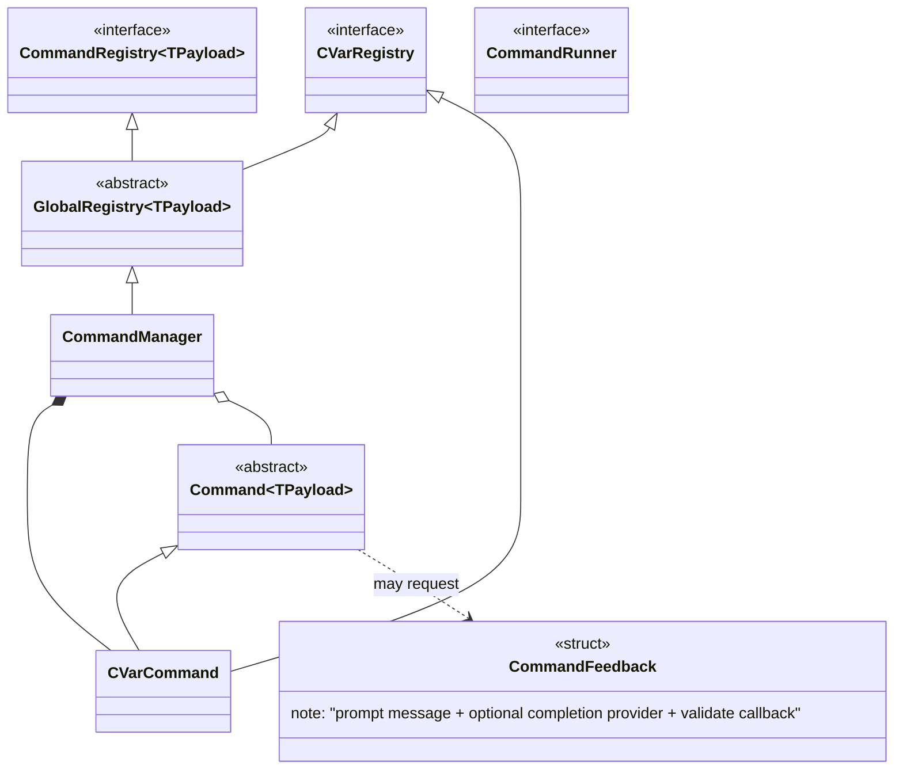
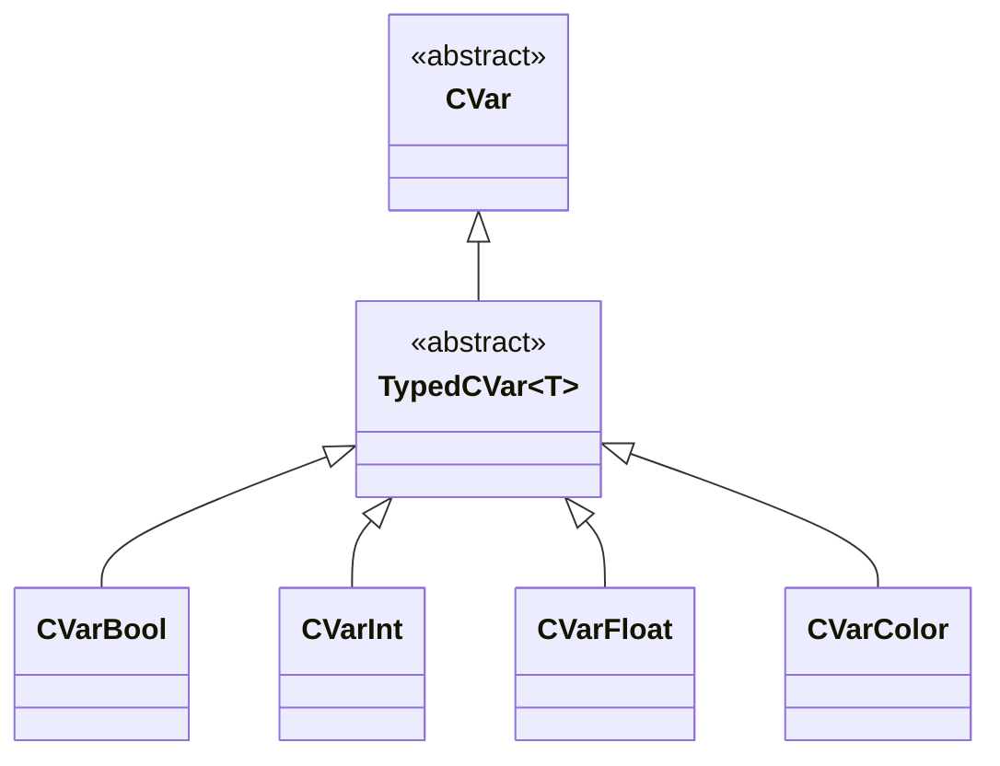
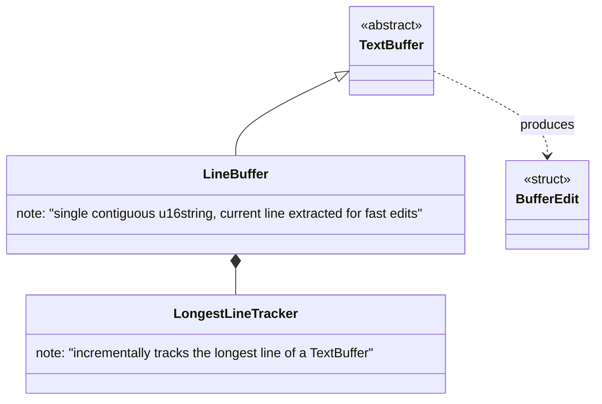
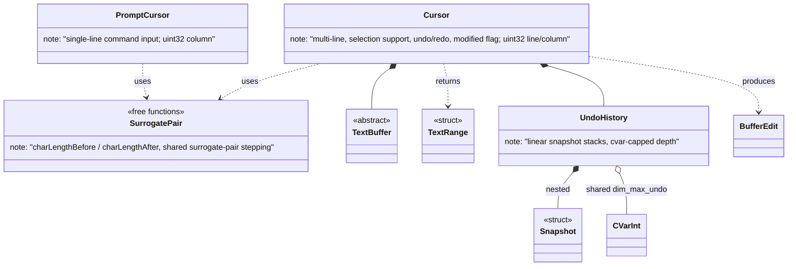
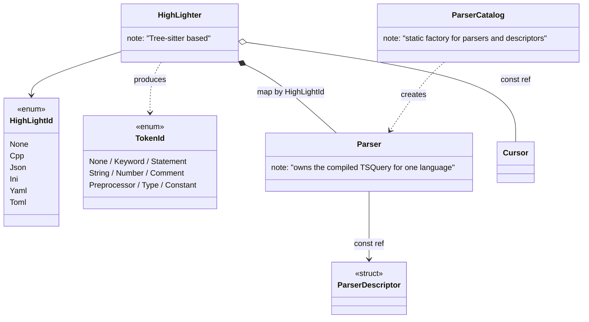
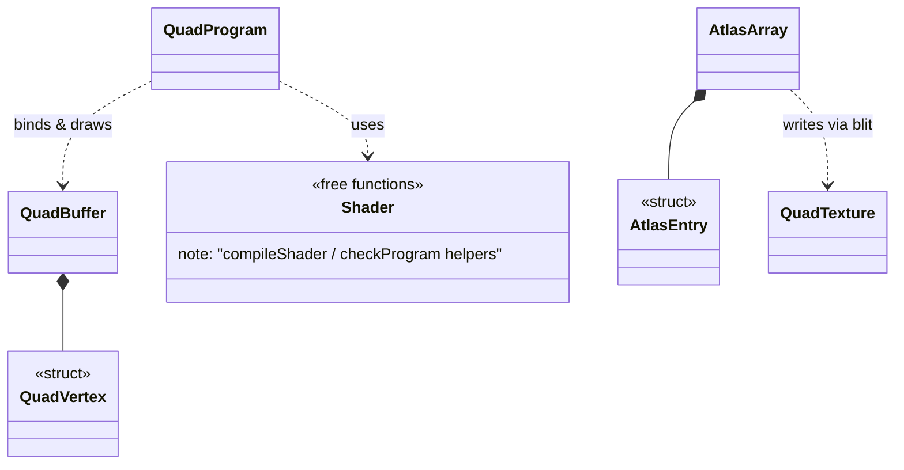
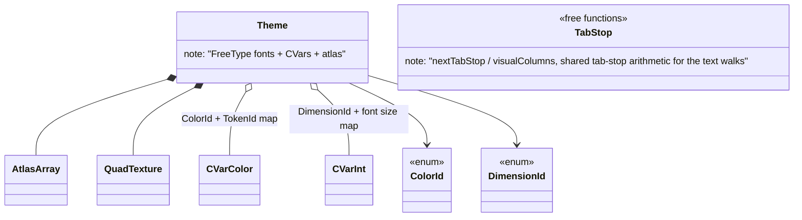
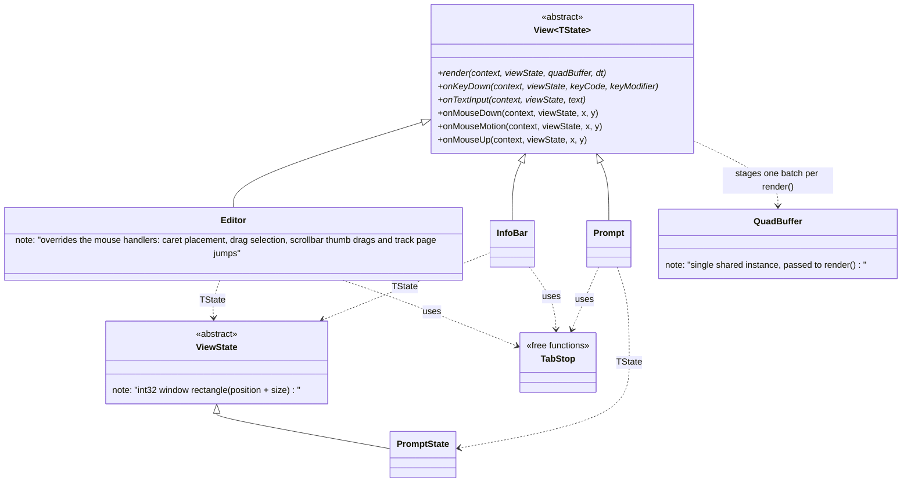
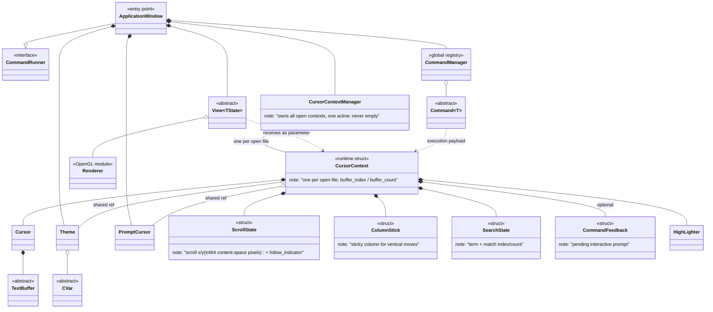

# Class Diagram — C++ Text Editor

---

## 1. Command System (`core/base` + `core/`)

---

## 2. Configuration Variables (`core/cvar`)

---

## 3. Text Buffers (`core/cursor/buffer`)

---

## 4. Cursors (`core/cursor`)

---

## 5. Syntax Highlighting (`core/highlighter`)

---

## 6. OpenGL Renderer (`core/renderer`)

---

## 7. Theme (`core/theme`)

---

## 8. Views & States (`core/` + `editor/` + `infobar/` + `prompt/`)

The mouse handlers have empty default implementations; `InfoBar` and `Prompt` keep them.
`ApplicationWindow::mainLoop` routes a left `SDL_MOUSEBUTTONDOWN` to the view whose rectangle
contains the point, then captures that view: `SDL_MOUSEMOTION` and `SDL_MOUSEBUTTONUP` keep
going to it until the button is released, even when the pointer leaves the view.

---

## 9. Concrete Commands (`command/`)

```mermaid
classDiagram
    class Command~CursorContext~ {
        <<abstract>>
    }
    class BindCommand
    class MoveCursorCommand
    class AutoCompleteCommand
    class ActivatePromptCommand
    class FontSizeCommand
    class ResetCVarFloatCommand
    class OpenFileCommand {
        note: "activates the existing buffer when the file is already open, via CursorContextManager"
    }
    class SaveFileCommand
    class ExecCommand
    class QuitCommand {
        note: "confirms when any open buffer is modified, via CursorContextManager"
    }
    class SetHighLightCommand
    class CopyTextCommand
    class CutTextCommand
    class PasteTextCommand
    class UndoCommand
    class RedoCommand
    class SearchCommand {
        note: "search / find_next / find_prev / replace / replace_all"
    }
    class GotoLineCommand
    class BufferCommand {
        note: "buffer next / prev / close / name, via CursorContextManager"
    }

    Command~CursorContext~ <|-- BindCommand
    Command~CursorContext~ <|-- MoveCursorCommand
    Command~CursorContext~ <|-- AutoCompleteCommand
    Command~CursorContext~ <|-- ActivatePromptCommand
    Command~CursorContext~ <|-- FontSizeCommand
    Command~CursorContext~ <|-- ResetCVarFloatCommand
    Command~CursorContext~ <|-- OpenFileCommand
    Command~CursorContext~ <|-- SaveFileCommand
    Command~CursorContext~ <|-- ExecCommand
    Command~CursorContext~ <|-- QuitCommand
    Command~CursorContext~ <|-- SetHighLightCommand
    Command~CursorContext~ <|-- CopyTextCommand
    Command~CursorContext~ <|-- CutTextCommand
    Command~CursorContext~ <|-- PasteTextCommand
    Command~CursorContext~ <|-- UndoCommand
    Command~CursorContext~ <|-- RedoCommand
    Command~CursorContext~ <|-- SearchCommand
    Command~CursorContext~ <|-- GotoLineCommand
    Command~CursorContext~ <|-- BufferCommand
```

---

## 10. Global Overview

